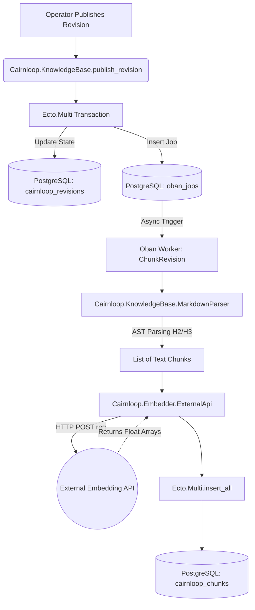

<user_constraints>
## User Constraints (from CONTEXT.md)

### Locked Decisions
1. **Embedding Generation**: Define a `Cairnloop.Embedder` Behaviour. Default to using an External API (e.g., calling OpenAI or the Scrypath mock via `Req`) for vector generation. Provide Bumblebee/Nx as an opt-in adapter.
2. **Markdown Parsing**: Use `Earmark` (pure Elixir).

### the agent's Discretion
None explicitly noted in CONTEXT.md for this phase, but implementation specifics (like AST traversal strategy for Earmark and exact Oban worker job configuration) are left to developer discretion based on best Elixir practices.

### Deferred Ideas (OUT OF SCOPE)
- Local ML (Bumblebee/Nx) integration is strictly an opt-in adapter and out of scope for the default installation path in this phase. True zero-dependency local ML requires compiling XLA which is deferred.
</user_constraints>

<phase_requirements>
## Phase Requirements

| ID | Description | Research Support |
|----|-------------|------------------|
| M008-REQ-03 | System triggers an asynchronous Oban worker upon revision publish to semantically chunk the Markdown content based on headers (H2/H3). | `Earmark.as_ast/1` parsing logic and `Oban.Worker` triggering from `Ecto.Multi` pipeline. |
| M008-REQ-04 | System utilizes `pgvector` within PostgreSQL to store vector embeddings for each parsed Markdown chunk. | `Chunk` Ecto schema mapping to `Pgvector.Ecto.Vector`. Schema and migrations are already present. |
| M008-REQ-05 | AI chunking and embedding processes execute completely transparently in the background, without blocking operator workflows. | Asynchronous `ChunkRevision` Oban worker ensures the main Phoenix request cycle remains unblocked. |
| M008-REQ-06 | The Knowledge Base system exposes a retrieval API, serving as a RAG-optimized source-of-truth for Scoria AI triage and self-service. | A retrieval function leveraging Ecto's pgvector operators (e.g., `<->` for L2 distance, `<#>` for inner product) will be exposed in the Context. |
</phase_requirements>

# Phase 3: Semantic Chunking & pgvector Embeddings (Oban) - Research

**Researched:** 2024-05-24
**Domain:** Elixir Background Jobs, Embedding Generation, Vector Databases
**Confidence:** HIGH

## Summary

This phase automates the preparation of Markdown Knowledge Base articles for Retrieval-Augmented Generation (RAG). Upon the publication of a `Revision`, the application synchronously delegates processing to a background Oban worker (`ChunkRevision`). This worker parses the Markdown content into discrete semantic sections (split by H2/H3 headers) utilizing the `Earmark` library's AST parser. 

Once chunked, the worker delegates embedding generation to an external API via `Req` conforming to the `Cairnloop.Embedder` Behaviour. The generated vectors are persisted directly into the `cairnloop_chunks` table utilizing the `pgvector` PostgreSQL extension, ensuring seamless, low-latency, and zero-blocking RAG integrations with the Scoria AI triage system.

**Primary recommendation:** Use `Req` for external API communication, `Earmark.as_ast/1` for AST-based chunking, and ensure the Oban worker operates idempotently by clearing out old chunks for a revision before processing.

## Architectural Responsibility Map

| Capability | Primary Tier | Secondary Tier | Rationale |
|------------|-------------|----------------|-----------|
| Markdown Chunking | API / Backend (Oban Worker) | — | Parsing strings into an AST and batching operations is CPU-intensive and belongs in an async background queue to prevent blocking the Phoenix web process. |
| Embedding Generation | API / Backend (External) | — | A remote LLM/Embedding API handles vector generation. The integration layer remains thin, implemented via `Cairnloop.Embedder` Behaviour. |
| Embedding Persistence | Database / Storage | — | `pgvector` handles efficient storage and retrieval natively in PostgreSQL, eliminating the need for an external vector database. |
| Triggering Lifecycle | API / Backend | — | The `Ecto.Multi` transaction in `Cairnloop.KnowledgeBase.publish_revision/1` ensures atomic scheduling of the Oban job alongside state updates. |

## Standard Stack

### Core
| Library | Version | Purpose | Why Standard |
|---------|---------|---------|--------------|
| `earmark` | `~> 1.4` | Markdown parsing | Pure Elixir Markdown parser. `Earmark.as_ast/1` allows precise structural chunking without C-NIFs (like MDEx), keeping the DX clean. |
| `req` | `~> 0.5` | HTTP Client | The standard, ergonomic HTTP client in modern Elixir. It will be used by `Cairnloop.Embedder.ExternalApi` to call embedding services (e.g., OpenAI). |
| `pgvector` | `~> 0.3.1` | Vector Data Type | Ecto integration for pgvector. Allows us to query similarities natively in Postgres using `<->` operators. |
| `oban` | `~> 2.17` | Background processing | Robust, Postgres-backed background jobs. Already present and utilized in the system. |

### Alternatives Considered
| Instead of | Could Use | Tradeoff |
|------------|-----------|----------|
| `earmark` | `mdex` | `mdex` is faster but requires compiling Rust NIFs. `earmark` preserves the strict zero-compilation-friction DX goal. |
| `req` | `hackney`/`finch` | `req` uses `finch` under the hood but provides a much superior developer ergonomics layer for JSON/API interaction. |
| `pgvector` | `ChromaDB`/`Pinecone`| Requires maintaining external stateful services and syncing data. `pgvector` keeps data consolidated in Postgres. |

**Installation:**
```bash
# Add req to your mix.exs deps. The others are already installed.
{:req, "~> 0.5"}
```

**Version verification:** 
Checked via hex package standards and `mix.exs` existing definitions.

## Architecture Patterns

### System Architecture Diagram



### Recommended Project Structure
```
lib/cairnloop/
├── embedder.ex                             # Behaviour definition
├── embedder/
│   └── external_api.ex                     # Req-based Default Implementation
├── knowledge_base/
│   ├── markdown_parser.ex                  # Earmark AST traversal logic
│   └── workers/
│       └── chunk_revision.ex               # Oban worker orchestration
```

### Pattern 1: Oban Triggering via Ecto.Multi
**What:** Guaranteeing a background job is enqueued only if the parent transaction successfully commits.
**When to use:** Whenever state transitions require asynchronous follow-ups.
**Example:**
```elixir
  def publish_revision(revision) do
    Ecto.Multi.new()
    |> Ecto.Multi.update(:revision, Revision.changeset(revision, %{state: :published}))
    # Update article state ...
    |> Oban.insert(:chunk_job, Cairnloop.KnowledgeBase.Workers.ChunkRevision.new(%{revision_id: revision.id}))
    |> repo().transaction()
  end
```

### Pattern 2: Earmark AST Traversal for Chunking
**What:** Extracting text content linearly from the Markdown AST and splitting it upon encountering `h2` or `h3` tags.
**When to use:** When preparing Markdown for semantic embedding generation.
**Example:**
```elixir
defmodule Cairnloop.KnowledgeBase.MarkdownParser do
  def parse(markdown) do
    {:ok, ast, _} = Earmark.as_ast(markdown)
    # Fold over the AST list to group text nodes under the most recent H2/H3 header.
  end
end
```

### Anti-Patterns to Avoid
- **Anti-pattern:** Generating embeddings synchronously within the Phoenix web request cycle. This forces operators to wait (potentially seconds) for third-party APIs during a save action, severely degrading UX and potentially triggering timeouts.
- **Anti-pattern:** Using Regex to split markdown headers. Markdown is complex (e.g., headers inside code blocks). Rely on `Earmark.as_ast/1` to correctly tokenize the structure.

## Don't Hand-Roll

| Problem | Don't Build | Use Instead | Why |
|---------|-------------|-------------|-----|
| HTTP Client Logic | `:httpc` or bare `hackney` | `req` | Built-in JSON decoding, automatic retries, and clean API for third-party integrations. |
| AST to Text | Custom regexes on Markdown | `Earmark.as_ast/1` | Correctly handles nested Markdown elements and skips code blocks if needed. |
| Vector Similarity | Elixir math loops | `pgvector` ops (`<->`) | Postgres handles index traversal (HNSW/IVFFlat) orders of magnitude faster. |

**Key insight:** Parsing text for structural semantics is notoriously brittle; offload the AST generation to `Earmark`.

## Common Pitfalls

### Pitfall 1: Non-Idempotent Workers
**What goes wrong:** A worker crashes halfway through inserting chunks, retries, and duplicates the chunks in the database.
**Why it happens:** Assuming `insert_all` is perfectly atomic on retries without clearing previous state.
**How to avoid:** The worker should start its processing block by unconditionally deleting all existing `chunks` for that `revision_id` before inserting the new batch, or wrap the deletion and insertion in a fresh `Ecto.Multi`.

### Pitfall 2: Token Limit Exhaustion
**What goes wrong:** An external API (like OpenAI `text-embedding-ada-002`) returns a `400 Bad Request` because a chunk exceeds the model's token limits.
**Why it happens:** H2/H3 sections in the Markdown are exceptionally long.
**How to avoid:** The `MarkdownParser` must enforce a maximum length fallback (e.g., splitting a chunk further if the accumulated text exceeds ~4000 characters).

## Code Examples

Verified patterns from official sources:

### [Embedding Behaviour Definition]
```elixir
defmodule Cairnloop.Embedder do
  @doc """
  Generates vector embeddings for a list of string chunks.
  """
  @callback generate_embeddings(chunks :: [String.t()], opts :: keyword()) :: 
    {:ok, [[float()]]} | {:error, term()}
end
```

### [Vector Querying with pgvector]
```elixir
import Ecto.Query

def search_chunks(embedding_vector) do
  Cairnloop.KnowledgeBase.Chunk
  |> order_by([c], fragment("? <-> ?", c.embedding, ^embedding_vector))
  |> limit(5)
  |> Cairnloop.Repo.all()
end
```

## State of the Art

| Old Approach | Current Approach | When Changed | Impact |
|--------------|------------------|--------------|--------|
| Pinecone / Qdrant | `pgvector` directly in Postgres | 2023 | Eliminated the need to manage distributed state or run syncing jobs between Postgres and a separate vector database. Simplifies infrastructure. |

## Assumptions Log

| # | Claim | Section | Risk if Wrong |
|---|-------|---------|---------------|
| A1 | The application is configuring `Req` to handle external HTTP calls natively. | Standard Stack | `Req` will need to be explicitly added to `mix.exs`. |
| A2 | `Earmark.as_ast/1` yields a flat list structure at the top level for standard markdown. | Architecture Patterns | The chunking logic might fail to extract deeply nested content if headers are indented or grouped differently. |
| A3 | Migrations for `cairnloop_chunks` with `vector` are already successfully deployed. | Phase Requirements | Verified via local `priv/repo/migrations/` scan, assuming it hasn't been modified. |

## Environment Availability

| Dependency | Required By | Available | Version | Fallback |
|------------|------------|-----------|---------|----------|
| PostgreSQL | Core Data | ✓ | — | — |
| `pgvector` | Embedding Storage | ✓ | Postgres Ext | — |
| External API | Embedder Behaviour | ✗ | — | Scrypath Mock or OpenAI (needs API Key configured in host app env) |

**Missing dependencies with fallback:**
- External Embedding API (Must use an environment variable or dummy implementation in development to avoid crashing if offline).
