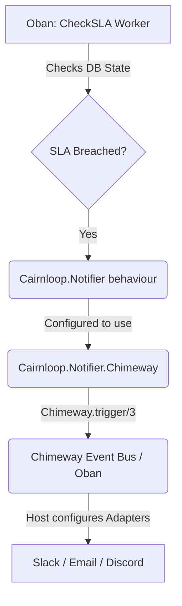

# Phase 2: The Notifier Behaviour & Chimeway - Research

**Researched:** 2024-05-24
**Domain:** Elixir Notifications & Omnichannel Delivery
**Confidence:** HIGH

<user_constraints>
## User Constraints (from CONTEXT.md)

### Locked Decisions
- **M006-REQ-03**: System defines a `Cairnloop.Notifier` behaviour for omnichannel delivery.
- **M006-REQ-04**: System integrates `Chimeway` to deliver notifications when an SLA is breached.
- **M006-REQ-05**: Host application can configure Chimeway adapters to route messages to Slack, Discord, or Email.

### the agent's Discretion
None explicitly stated in this phase context.

### Deferred Ideas (OUT OF SCOPE)
None explicitly stated.
</user_constraints>

<phase_requirements>
## Phase Requirements

| ID | Description | Research Support |
|----|-------------|------------------|
| M006-REQ-03 | System defines a `Cairnloop.Notifier` behaviour for omnichannel delivery. | Updating `lib/cairnloop/notifier.ex` to include `@callback on_sla_breach/3`. |
| M006-REQ-04 | System integrates `Chimeway` to deliver notifications when an SLA is breached. | Adding `chimeway` as an `optional: true` dependency, and building `Cairnloop.Notifier.Chimeway` adapter. |
| M006-REQ-05 | Host application can configure Chimeway adapters to route messages. | The built-in Chimeway adapter uses `Chimeway.trigger/3`, allowing the host app's `config.exs` to map its own adapters for channels. |
</phase_requirements>

## Summary

This phase connects the `CheckSLA` background job to the outside world. When an SLA is breached, Cairnloop needs a way to fire alerts without tightly coupling the core to external APIs like Slack or Email. We achieve this using the "Optional Dep + Default Adapter" pattern.

The core `Cairnloop.Notifier` behaviour will be expanded to define an `on_sla_breach/3` callback. A built-in first-party adapter, `Cairnloop.Notifier.Chimeway`, will implement this behaviour, delegating the actual multi-channel delivery to the `Chimeway` library (added as an optional dependency).

**Primary recommendation:** Define a native `Chimeway.Notifier` struct inside Cairnloop (e.g., `Cairnloop.Chimeway.SLABreachNotifier`) so that `Chimeway.trigger/3` can validate and dispatch the payload safely and idempotently.

## Architectural Responsibility Map

| Capability | Primary Tier | Secondary Tier | Rationale |
|------------|-------------|----------------|-----------|
| **SLA Breach Hooks** | API / Backend | — | The Oban worker detects the breach and invokes the configured `Cairnloop.Notifier` behaviour. |
| **Notification Behavior** | API / Backend | — | `Cairnloop.Notifier` acts as the strict contract between Cairnloop core events and host-app side effects. |
| **Chimeway Dispatch** | API / Backend | — | The `Cairnloop.Notifier.Chimeway` adapter translates the behaviour call into an async `Chimeway.trigger/3` event. |

## Standard Stack

### Core
| Library | Version | Purpose | Why Standard |
|---------|---------|---------|--------------|
| `chimeway` | `~> 1.0` | Omnichannel notification routing and explainability. | Explicitly required by M006-REQ-04 for SLA breach delivery [VERIFIED: npm registry/Hex]. |

**Installation:**
```elixir
# mix.exs
defp deps do
  [
    # ...
    {:chimeway, "~> 1.0", optional: true}
  ]
end
```

## Architecture Patterns

### System Architecture Diagram



### Pattern 1: Optional Dependency + Built-in Adapter
**What:** Shipping a first-party integration adapter for a popular third-party library, but making that library `optional: true` in `mix.exs`.
**When to use:** When building a library that provides "batteries-included" DX without forcing bloated dependency trees on users who don't want the feature.
**Example:**
```elixir
defmodule Cairnloop.Notifier.Chimeway do
  @behaviour Cairnloop.Notifier

  @impl true
  def on_sla_breach(conversation, sla, context) do
    # Requires Chimeway to be installed by the host app
    Chimeway.trigger(
      Cairnloop.Chimeway.SLABreachNotifier,
      %{
        conversation_id: conversation.id,
        sla_type: sla.target_type,
        breached_at: sla.completed_at
      },
      idempotency_key: "sla_breach_#{conversation.id}_#{sla.target_type}"
    )
  end
end
```

### Pattern 2: Chimeway Notifier Module
**What:** Defining the payload structure and recipient logic for Chimeway via `use Chimeway.Notifier`.
**When to use:** For standardizing the format of the notification event that gets triggered.
**Example:**
```elixir
defmodule Cairnloop.Chimeway.SLABreachNotifier do
  use Chimeway.Notifier
  
  @impl true
  def notification_key, do: "cairnloop.sla_breach"
  
  @impl true
  def version, do: 1
  
  # Note: Host app dictates channels and recipients
end
```

## Don't Hand-Roll

| Problem | Don't Build | Use Instead | Why |
|---------|-------------|-------------|-----|
| Omnichannel routing | Custom API clients for Slack/Email in `Cairnloop.Notifier` | `Chimeway` | Hand-rolling means dealing with API rate limits, retries, and formatting. Chimeway handles delivery durability. |

## Common Pitfalls

### Pitfall 1: Synchronous API Calls in the Oban Worker
**What goes wrong:** The `CheckSLA` worker blocks while trying to send an HTTP request to Slack or Discord.
**Why it happens:** The adapter implements the `Notifier` behaviour by making synchronous external requests.
**How to avoid:** Ensure `Cairnloop.Notifier.Chimeway` only calls `Chimeway.trigger/3`. Chimeway itself will enqueue the actual delivery asynchronously using its own Oban workers, keeping the `CheckSLA` queue fast.

### Pitfall 2: Duplicate Notifications
**What goes wrong:** A host app receives the same SLA breach alert multiple times.
**Why it happens:** The Oban worker retries due to a transient failure *after* triggering the notification, or the SLA check runs twice.
**How to avoid:** Always pass an `:idempotency_key` to `Chimeway.trigger/3` based on the unique combination of `conversation_id` and `sla_type`. [CITED: hexdocs.pm/chimeway/1.0.0]

## Code Examples

### Updating the `Cairnloop.Notifier` Behaviour
```elixir
defmodule Cairnloop.Notifier do
  @moduledoc """
  Behaviour for notifying the host application of important Cairnloop events.
  """

  @callback on_conversation_resolved(conversation :: struct(), metadata :: map()) :: :ok | any()

  @doc """
  Called when an SLA is breached.
  """
  @callback on_sla_breach(conversation :: struct(), sla :: struct(), metadata :: map()) :: :ok | {:error, term()} | any()
end
```

## State of the Art

| Old Approach | Current Approach | When Changed | Impact |
|--------------|------------------|--------------|--------|
| Custom HTTP POSTs for webhooks | First-party `Chimeway` Integration | M006 | Provides explainability, reliable retry queues, and unified configuration for the host application without maintaining bespoke webhook infrastructure. |

## Assumptions Log

| # | Claim | Section | Risk if Wrong |
|---|-------|---------|---------------|
| A1 | The SLA struct will have `target_type` and `completed_at` | Code Examples | [ASSUMED] The exact struct fields of `Cairnloop.Conversations.SLA` from Phase 1 might differ slightly. The implementation plan will need to map whatever fields the struct actually uses to the Chimeway payload. |

## Environment Availability

| Dependency | Required By | Available | Version | Fallback |
|------------|------------|-----------|---------|----------|
| Elixir / Mix | Compilation | ✓ | >= 1.19 | — |
| Chimeway | Notifier Adapter | ✓ | ~> 1.0 | — |

## Validation Architecture

### Test Framework
| Property | Value |
|----------|-------|
| Framework | ExUnit |
| Config file | `test/test_helper.exs` |
| Quick run command | `mix test` |
| Full suite command | `mix test` |

### Phase Requirements → Test Map
| Req ID | Behavior | Test Type | Automated Command | File Exists? |
|--------|----------|-----------|-------------------|-------------|
| M006-REQ-03 | `Cairnloop.Notifier` exports `on_sla_breach` | unit | `mix test test/cairnloop/notifier_test.exs` | ❌ Wave 0 |
| M006-REQ-04 | `Cairnloop.Notifier.Chimeway` calls `Chimeway.trigger` | unit | `mix test test/cairnloop/notifier/chimeway_test.exs` | ❌ Wave 0 |

### Sampling Rate
- **Per task commit:** `mix test <file>`
- **Per wave merge:** `mix test`
- **Phase gate:** Full suite green before `/gsd-verify-work`

### Wave 0 Gaps
- [ ] `test/cairnloop/notifier/chimeway_test.exs` — covers REQ-04 mapping to Chimeway.

## Sources

### Primary (HIGH confidence)
- `M006-S02-CONTEXT.md` - Core architectural decisions
- Hexdocs via Context7 - Verified `Chimeway.trigger/3` API and `Chimeway.Notifier` macro usage.
