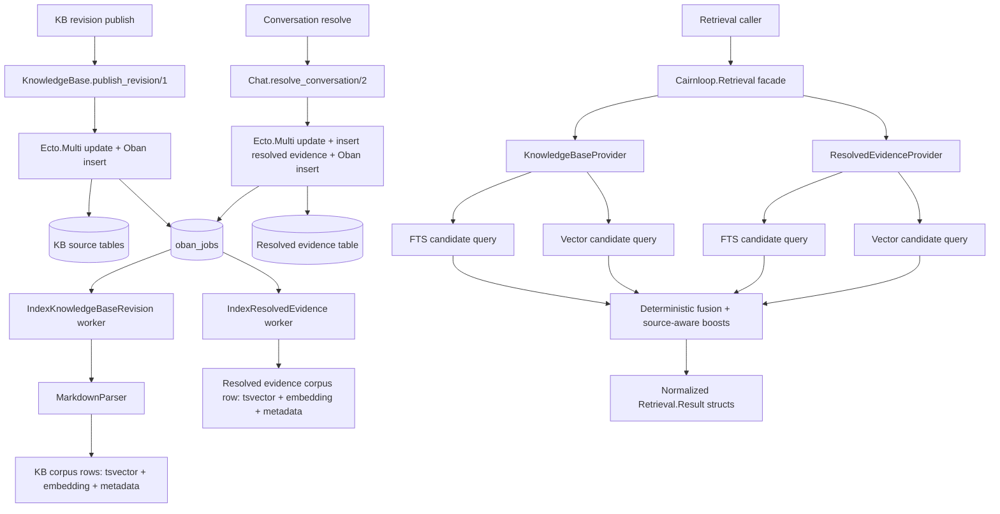

# Phase 1: Hybrid Retrieval Corpus & APIs - Research

**Researched:** 2026-05-17
**Domain:** Elixir/Phoenix retrieval corpus design with PostgreSQL full-text search, pgvector, Ecto, and Oban
**Confidence:** HIGH

<user_constraints>
## User Constraints (from CONTEXT.md) [VERIFIED: `.planning/milestones/M009-phases/M009-S01-CONTEXT.md`]

### Locked Decisions
- **D-01:** Downstream agents should default to decisive, idiomatic choices that fit Cairnloop's existing architecture and milestone goals. Re-escalate to the user only for decisions that materially change product posture, trust semantics, or scope.
- **D-02:** Principle of least surprise beats novelty. Prefer boring, inspectable retrieval behavior and a small public surface over clever ranking or broad configuration.

### Resolved support evidence shape
- **D-03:** Do not index full conversation transcripts as first-class retrieval documents.
- **D-04:** Model resolved conversations as a structured, assistive evidence record created at resolution time and stored separately from canonical Knowledge Base content.
- **D-05:** The structured evidence record should include, at minimum: `conversation_id`, `subject`, `issue_summary`, `resolution_note`, `actions_taken`, `outcome`, `resolved_at`, bounded intent/product metadata, and citation backreferences to the underlying messages or spans.
- **D-06:** Keep transcript/history available as source material for citations, audit, and regeneration, but not as the primary retrieval document.
- **D-07:** Resolved evidence must be clearly labeled as assistive evidence rather than canonical policy truth.

### Retrieval API boundary
- **D-08:** Expose one internal retrieval context as the paved-road API for Cairnloop callers. Recommended shape: `Cairnloop.Retrieval`.
- **D-09:** Implement the public retrieval context as a facade over specialized provider modules rather than a single monolith or multiple public low-level APIs.
- **D-10:** Use separate provider internals for canonical Knowledge Base retrieval and resolved-case retrieval so trust semantics, indexing strategies, and filters remain explicit.
- **D-11:** Normalize result structs across providers with fields such as `source_type`, `trust_level`, `visibility`, `citation_target`, `match_reasons`, and `can_ground_reply?`.
- **D-12:** LiveViews, workers, and future AI flows should call the retrieval context instead of reaching directly to remote search services.

### Hybrid ranking behavior
- **D-13:** Use deterministic hybrid retrieval as the Phase 1 default: run PostgreSQL full-text search and pgvector similarity retrieval in parallel, then fuse the candidate sets with deterministic reranking.
- **D-14:** Prefer rank-based fusion and explicit source-aware boosts over raw score blending or learned weighting in Phase 1.
- **D-15:** Canonical Knowledge Base hits should rank above similar resolved-case evidence when the evidence quality is otherwise comparable.
- **D-16:** Ranking must be explainable. Return stable ordering plus match reasons that can support operator trust, citation rails, and later Scoria traces.
- **D-17:** Do not ship hidden vector-first or keyword-first fallback magic as the default retrieval model for Phase 1.
- **D-18:** Defer learned weighting, query-class routing, and opaque confidence models until retrieval telemetry and evaluation loops exist in later phases.

### Index lifecycle and recovery
- **D-19:** Indexing should be event-driven by default and durably tied to the source-of-truth write path.
- **D-20:** Knowledge Base publish and resolved-conversation indexing should enqueue durable Oban work from transactional application boundaries, not from best-effort side paths.
- **D-21:** Retrieval indexing workers must be idempotent and keyed by stable natural identifiers such as `source_kind + source_id + source_version + chunk_idx`.
- **D-22:** Phase 1 must include explicit developer recovery primitives for replay and rebuild, such as `reindex_revision/1`, `reindex_conversation/1`, `replay_failed/1`, `rebuild_corpus/1`, and matching Mix tasks.
- **D-23:** Do not build a heavy operator control plane for retrieval lifecycle management in this phase.
- **D-24:** Oban uniqueness may help reduce duplicate inserts, but it is not the primary correctness guarantee. Idempotent writes and replayability are the real durability model.

### Safety, visibility, and trust
- **D-25:** Apply tenant, audience, and visibility filtering before ranking, not after.
- **D-26:** Keep canonical KB content and assistive resolved-case evidence separated in storage, ranking, and UI labels, even if both are returned through one retrieval facade.
- **D-27:** Retrieval misses and weak-evidence outcomes should produce an explicit "no trustworthy grounding" result rather than forcing a low-trust answer path.

### the agent's Discretion
- Exact schema names and module breakdown under the retrieval context
- Specific deterministic fusion formula, so long as it is transparent, bounded, and easy to test
- Exact mix task names and worker naming
- Internal query/window sizing and cutoff tuning

### Deferred Ideas (OUT OF SCOPE)
- Learned rank weighting, LTR-style reranking, or query-class routing after retrieval telemetry/evals exist
- A dedicated retrieval operations UI or control plane
- Full transcript retrieval as a first-class search corpus
- Broader search UX decisions for `cmd+k` and result presentation, which belong to M009 Phase 2
- Citation rendering and weak-grounding fallback UX in AI draft review, which belong to M009 Phase 3
</user_constraints>

<phase_requirements>
## Phase Requirements [VERIFIED: `.planning/REQUIREMENTS.md` + `.planning/M009-ROADMAP.md`]

| ID | Description | Research Support |
|----|-------------|------------------|
| M009-REQ-01 | System indexes published Knowledge Base revisions into a hybrid retrieval corpus that supports both semantic similarity and keyword search. | Use a dedicated KB corpus table with `embedding` plus `tsvector`, written by an Oban worker triggered from `publish_revision/1`, and queried through a provider under `Cairnloop.Retrieval`. [VERIFIED: `lib/cairnloop/knowledge_base.ex` + `lib/cairnloop/knowledge_base/workers/chunk_revision.ex` + https://hexdocs.pm/pgvector/readme.html + https://www.postgresql.org/docs/current/functions-textsearch.html] |
| M009-REQ-02 | System indexes resolved conversation summaries separately from Knowledge Base content and marks them as assistive evidence rather than canonical policy. | Create a separate resolved-evidence schema/table keyed by `conversation_id`, store structured evidence fields, and return `source_type` / `trust_level` labels from the retrieval facade. [VERIFIED: `.planning/milestones/M009-phases/M009-S01-CONTEXT.md` + `lib/cairnloop/chat.ex` + `lib/cairnloop/conversation.ex` + `lib/cairnloop/message.ex`] |
| M009-REQ-03 | System updates retrieval indexes asynchronously via Oban when Knowledge Base revisions publish and when conversations resolve. | Insert retrieval jobs from transactional boundaries with `Oban.insert` in the same `Ecto.Multi`, keep workers idempotent, and expose replay/rebuild helpers for failures and backfills. [VERIFIED: `lib/cairnloop/knowledge_base.ex` + `lib/cairnloop/chat.ex` + https://hexdocs.pm/oban/Oban.html + https://hexdocs.pm/oban/unique_jobs.html + https://hexdocs.pm/oban/recursive-jobs.html] |
</phase_requirements>

## Summary

The current repo already has the right substrate for Phase 1, but not the retrieval boundary the milestone needs. `Cairnloop.KnowledgeBase.publish_revision/1` flips a revision to `:published` and enqueues `ChunkRevision`, while `ChunkRevision` parses markdown and rewrites vector-only chunk rows in `cairnloop_chunks`; however, the chunk schema has no keyword-search column, no visibility metadata, and no natural-key chunk index. `Chat.resolve_conversation/2` updates conversation state and enqueues notification work, but it does not create any durable resolved-evidence corpus record. The current search UI still posts directly to Scrypath instead of an internal retrieval API. [VERIFIED: `lib/cairnloop/knowledge_base.ex` + `lib/cairnloop/knowledge_base/workers/chunk_revision.ex` + `lib/cairnloop/knowledge_base/chunk.ex` + `lib/cairnloop/chat.ex` + `lib/cairnloop/web/search_modal_component.ex`]

Phase 1 should introduce a host-owned `Cairnloop.Retrieval` facade with two internal providers: one for canonical Knowledge Base chunks and one for resolved-case evidence. The storage should stay physically separate: keep chunked KB corpus rows for published revisions, and create a separate structured resolved-evidence table keyed by `conversation_id`. Each provider should run PostgreSQL full-text search and pgvector similarity over its own corpus, apply tenant/audience/visibility filters before ranking, and return normalized retrieval results through one facade. [VERIFIED: `.planning/milestones/M009-phases/M009-S01-CONTEXT.md` + `.planning/REQUIREMENTS.md` + https://github.com/pgvector/pgvector + https://www.postgresql.org/docs/current/functions-textsearch.html]

The safest plan is boring on purpose: transactional job enqueueing with `Oban.insert`, idempotent corpus writes keyed by natural identifiers, deterministic rank fusion, and explicit replay/rebuild primitives. The repo's current test harness is mostly mock-driven and does not expose an in-tree `Cairnloop.Repo` module or `DataCase`, so Phase 1 planning should include Wave 0 test infrastructure for DB-backed retrieval queries rather than pretending the current unit tests cover FTS, pgvector, or visibility filtering. [VERIFIED: `test/cairnloop/knowledge_base_test.exs` + `test/cairnloop/chat_test.exs` + `test/test_helper.exs` + `config/config.exs` + `rg -n "defmodule Cairnloop\\.Repo|use Ecto\\.Repo|DataCase" lib config test`] 

**Primary recommendation:** Build `Cairnloop.Retrieval` as a facade over `KnowledgeBaseProvider` and `ResolvedEvidenceProvider`, store keyword and vector corpus data in Postgres, enqueue all indexing work through transactional Oban inserts, and standardize deterministic rank fusion plus replayable recovery as first-class Phase 1 deliverables. [VERIFIED: `.planning/milestones/M009-phases/M009-S01-CONTEXT.md` + `lib/cairnloop/knowledge_base.ex` + `lib/cairnloop/chat.ex` + https://hexdocs.pm/oban/Oban.html + https://github.com/pgvector/pgvector]

## Architectural Responsibility Map

| Capability | Primary Tier | Secondary Tier | Rationale |
|------------|-------------|----------------|-----------|
| Publish-time KB indexing | API / Backend | Database / Storage | Publishing already occurs in `KnowledgeBase.publish_revision/1`, and the write path already owns the Oban enqueue boundary. [VERIFIED: `lib/cairnloop/knowledge_base.ex`] |
| Resolved-evidence capture | API / Backend | Database / Storage | `Chat.resolve_conversation/2` is the transactional boundary where the structured evidence row should be created and its indexing job enqueued. [VERIFIED: `lib/cairnloop/chat.ex`] |
| Hybrid retrieval queries | API / Backend | Database / Storage | Full-text and vector ranking belong close to Ecto/Postgres so filters, trust semantics, and query composition stay inspectable and deterministic. [VERIFIED: `.planning/milestones/M009-phases/M009-S01-CONTEXT.md` + https://www.postgresql.org/docs/current/functions-textsearch.html + https://hexdocs.pm/pgvector/readme.html] |
| Visibility / tenant filtering | API / Backend | Database / Storage | The milestone explicitly requires filtering before ranking, which means the provider query must constrain rows before candidate scoring. [VERIFIED: `.planning/milestones/M009-phases/M009-S01-CONTEXT.md` + `.planning/REQUIREMENTS.md`] |
| Corpus persistence | Database / Storage | — | Both FTS and vector search are standard Postgres responsibilities in this milestone, with `vector` and `tsvector` data living beside source identifiers. [VERIFIED: `priv/repo/migrations/20260516000000_create_knowledge_base.exs` + https://hexdocs.pm/pgvector/readme.html + https://www.postgresql.org/docs/17/textsearch-indexes.html] |
| Search UI integration | Browser / Client | API / Backend | This phase only defines the internal API; operator-facing search remains Phase 2 and should call the retrieval facade later instead of remote HTTP directly. [VERIFIED: `.planning/M009-ROADMAP.md` + `lib/cairnloop/web/search_modal_component.ex`] |
| Recovery / backfill | API / Backend | Database / Storage | Replay and rebuild should be durable application functions and Oban jobs, not ad hoc SQL or one-shot scripts. [VERIFIED: `.planning/milestones/M009-phases/M009-S01-CONTEXT.md` + https://hexdocs.pm/oban/recursive-jobs.html + https://hexdocs.pm/oban/Oban.html] |

## Standard Stack

### Core
| Library | Version | Purpose | Why Standard |
|---------|---------|---------|--------------|
| PostgreSQL | 14.17 running locally | Persistence, full-text search, and corpus filtering | The local environment has PostgreSQL 14.17 running, and PostgreSQL's built-in text search supports `tsvector`, `tsquery`, `websearch_to_tsquery`, `ts_rank_cd`, and GIN indexes. [VERIFIED: `psql postgres -Atqc "SHOW server_version;"` + `pg_isready` + https://www.postgresql.org/docs/current/functions-textsearch.html + https://www.postgresql.org/docs/17/textsearch-indexes.html] |
| Ecto | 3.13.6, released 2026-05-05 | Query composition, transactions, schema ownership | `Ecto.Multi` gives the transaction boundary needed for source-of-truth writes and dynamic job enqueueing. [VERIFIED: `mix hex.info ecto` + https://hexdocs.pm/ecto/Ecto.Multi.html] |
| Ecto SQL | 3.13.5, released 2026-03-03 | SQL migrations and Postgres adapter glue | The repo already depends on `ecto_sql`, and Phase 1 will need migrations for corpus tables and indexes. [VERIFIED: `mix hex.info ecto_sql` + `mix.exs`] |
| Oban | 2.22.1, released 2026-04-30 | Durable async indexing, replay, and backfill | `Oban.insert` is the recommended enqueue path inside an `Ecto.Multi`, and Oban provides retry and recursive-job patterns needed for rebuilds. [VERIFIED: `mix hex.info oban` + https://hexdocs.pm/oban/Oban.html + https://hexdocs.pm/oban/recursive-jobs.html] |
| pgvector | 0.3.1, released 2025-06-23 | Vector storage and nearest-neighbor queries in Postgres | pgvector's Elixir integration supports `Pgvector.Ecto.Vector`, query helpers, and HNSW / IVFFlat indexes while staying host-owned. [VERIFIED: `mix hex.info pgvector` + https://hexdocs.pm/pgvector/readme.html + https://github.com/pgvector/pgvector] |
| Req | 0.5.17, released 2026-01-05 | Embedder HTTP calls and test doubles | The repo already uses Req and `Req.Test`; that matches the existing embedder and current mock-heavy tests. [VERIFIED: `mix hex.info req` + `lib/cairnloop/embedder/external_api.ex` + `test/cairnloop/automation/scoria_engine_test.exs` + https://hexdocs.pm/req/Req.html] |
| Earmark | 1.4.48, released 2025-06-21 | Markdown AST parsing for KB chunking | The repo already uses Earmark, but the current docs deprecate `Earmark.as_ast` in favor of `Earmark.Parser.as_ast`. [VERIFIED: `mix hex.info earmark` + `lib/cairnloop/knowledge_base/markdown_parser.ex` + https://hexdocs.pm/earmark/Earmark.html + https://hexdocs.pm/earmark/Earmark.Parser.html] |

### Supporting
| Library | Version | Purpose | When to Use |
|---------|---------|---------|-------------|
| Phoenix LiveView | 1.1.30, released 2026-05-05 | Internal callers of the retrieval facade in later phases | Phase 1 should not design UI around direct HTTP calls; Phase 2 callers should use `Cairnloop.Retrieval` from LiveView code. [VERIFIED: `mix.lock` + https://hex.pm/packages/phoenix_live_view + `lib/cairnloop/web/search_modal_component.ex`] |
| Oban.Testing | bundled with Oban 2.22.1 | Worker verification and queue draining in tests | Use `Oban.drain_queue/2` with recursion for replay/backfill workers and enqueue-chain tests. [VERIFIED: `test/cairnloop/workers/ingest_scrypath_test.exs` + https://hexdocs.pm/oban/Oban.html] |

### Alternatives Considered
| Instead of | Could Use | Tradeoff |
|------------|-----------|----------|
| Host-owned Postgres hybrid retrieval | External Scrypath search as the default retrieval plane | This conflicts with M009 out-of-scope constraints and keeps trust semantics outside the host app. [VERIFIED: `.planning/REQUIREMENTS.md` + `lib/cairnloop/web/search_modal_component.ex`] |
| `Oban.insert` in transactions | `Ecto.Multi.insert` of raw job changesets | Oban docs recommend `Oban.insert` because it preserves features like unique jobs. [VERIFIED: https://hexdocs.pm/oban/Oban.html] |
| `Earmark.Parser.as_ast` | `Earmark.as_ast` | `Earmark.as_ast` is deprecated and scheduled for removal in 1.5. [VERIFIED: https://hexdocs.pm/earmark/Earmark.html + https://hexdocs.pm/earmark/Earmark.Parser.html] |

**Installation:**
```bash
mix deps.get
mix ecto.migrate
```
No new core dependencies are required for Phase 1 if the plan stays inside the locked stack. [VERIFIED: `mix.exs` + `priv/repo/migrations/20260516000000_create_knowledge_base.exs`]

**Version verification:** Package versions and release dates were verified with `mix hex.info oban`, `mix hex.info pgvector`, `mix hex.info req`, `mix hex.info earmark`, `mix hex.info ecto`, and `mix hex.info ecto_sql` on 2026-05-17. [VERIFIED: local shell commands]

## Architecture Patterns

### System Architecture Diagram



The planner should keep write ownership in existing contexts and keep query ownership in a new retrieval context. That respects current repo boundaries while preventing LiveViews and workers from calling remote search APIs directly. [VERIFIED: `lib/cairnloop/knowledge_base.ex` + `lib/cairnloop/chat.ex` + `lib/cairnloop/web/search_modal_component.ex`]

### Recommended Project Structure
```text
lib/cairnloop/
├── retrieval.ex                                # Public facade
├── retrieval/
│   ├── result.ex                               # Normalized result struct
│   ├── query.ex                                # Input validation / filter struct
│   ├── rank_fusion.ex                          # Deterministic merge logic
│   ├── knowledge_base_provider.ex              # KB FTS + vector retrieval
│   ├── resolved_evidence.ex                    # Structured assistive evidence schema
│   ├── resolved_evidence_provider.ex           # Resolved-case retrieval
│   └── workers/
│       ├── index_knowledge_base_revision.ex    # Replaces vector-only write path
│       ├── index_resolved_evidence.ex          # Builds assistive evidence corpus
│       └── rebuild_corpus.ex                   # Recursive backfill worker
├── knowledge_base/
│   ├── markdown_parser.ex                      # Keep AST-based chunk extraction
│   └── chunk.ex                                # Either supersede or narrow to legacy use
└── mix/tasks/cairnloop/retrieval/
    ├── reindex_revision.ex
    ├── reindex_conversation.ex
    ├── replay_failed.ex
    └── rebuild_corpus.ex
```
This structure keeps `KnowledgeBase` and `Chat` as write owners and moves all retrieval reads plus recovery helpers under one explicit boundary. [VERIFIED: `.planning/milestones/M009-phases/M009-S01-CONTEXT.md` + current module layout in `lib/cairnloop/`]

### Pattern 1: Retrieval Facade Over Explicit Providers
**What:** Expose `Cairnloop.Retrieval` as the only public caller surface, with provider modules for canonical KB and assistive resolved evidence. [VERIFIED: `.planning/milestones/M009-phases/M009-S01-CONTEXT.md`]

**When to use:** Any internal search or grounding request from LiveView, worker, or automation code. [VERIFIED: `.planning/M009-ROADMAP.md`]

**Example:**
```elixir
# Source: adapted from .planning/milestones/M009-phases/M009-S01-CONTEXT.md
defmodule Cairnloop.Retrieval do
  alias Cairnloop.Retrieval.{KnowledgeBaseProvider, ResolvedEvidenceProvider, RankFusion}

  def search(query, opts \\ []) do
    kb = KnowledgeBaseProvider.search(query, opts)
    evidence = ResolvedEvidenceProvider.search(query, opts)
    RankFusion.merge(kb, evidence, opts)
  end
end
```

### Pattern 2: Transactional Enqueue, Worker-Owned Corpus Writes
**What:** Keep source-of-truth writes in `KnowledgeBase` / `Chat`, but let the indexing workers own all derived corpus fields such as `chunk_idx`, `embedding`, and `search_tsv`. [VERIFIED: `lib/cairnloop/knowledge_base.ex` + `lib/cairnloop/chat.ex` + `.planning/milestones/M009-phases/M009-S01-CONTEXT.md`]

**When to use:** Publishing KB revisions, resolving conversations, replaying failures, and backfilling old rows. [VERIFIED: `.planning/REQUIREMENTS.md` + https://hexdocs.pm/oban/recursive-jobs.html]

**Example:**
```elixir
# Source: adapted from https://hexdocs.pm/oban/Oban.html
Ecto.Multi.new()
|> Ecto.Multi.update(:revision, Revision.publish_changeset(revision))
|> Oban.insert(:index_revision, fn %{revision: revision} ->
  Cairnloop.Retrieval.Workers.IndexKnowledgeBaseRevision.new(
    %{"revision_id" => revision.id},
    unique: [period: :infinity, keys: [:revision_id]]
  )
end)
|> repo().transaction()
```

### Pattern 3: Deterministic Hybrid Retrieval
**What:** Run FTS and vector retrieval separately per provider, then merge by rank instead of blending incomparable raw scores. pgvector's own hybrid-search guidance points to Reciprocal Rank Fusion, and the phase decisions explicitly prefer rank-based fusion. [VERIFIED: https://github.com/pgvector/pgvector + `.planning/milestones/M009-phases/M009-S01-CONTEXT.md`]

**When to use:** All Phase 1 retrieval requests. [VERIFIED: `.planning/milestones/M009-phases/M009-S01-CONTEXT.md`]

**Example:**
```elixir
# Source: hybrid approach cited by https://github.com/pgvector/pgvector
def score_rank(rank, k \\ 60), do: 1.0 / (k + rank)

def fused_score(fts_rank, vector_rank, source_boost) do
  source_boost + score_rank(fts_rank) + score_rank(vector_rank)
end
```
The exact `k` value and candidate window sizes are planning defaults rather than repo facts. [ASSUMED]

### Pattern 4: Resolved Evidence as Structured Source Material
**What:** Insert a durable resolved-evidence record at resolution time, separate from transcripts and separate from KB chunks. Use the evidence record as the searchable assistive document, and keep transcript message IDs only as citation backreferences. [VERIFIED: `.planning/milestones/M009-phases/M009-S01-CONTEXT.md` + `lib/cairnloop/chat.ex` + `lib/cairnloop/message.ex`]

**When to use:** Only when a conversation transitions to `:resolved`. [VERIFIED: `.planning/REQUIREMENTS.md` + `lib/cairnloop/chat.ex`]

**Example:**
```elixir
# Source: adapted from locked decision D-05
%ResolvedEvidence{
  conversation_id: conversation.id,
  subject: conversation.subject,
  issue_summary: issue_summary,
  resolution_note: resolution_note,
  actions_taken: actions_taken,
  outcome: outcome,
  resolved_at: conversation.resolved_at,
  citation_refs: [%{message_id: 123}, %{message_id: 124}]
}
```

### Anti-Patterns to Avoid
- **Single shared corpus table for KB and resolved evidence:** This violates the locked storage and trust-semantics separation. [VERIFIED: `.planning/milestones/M009-phases/M009-S01-CONTEXT.md`]
- **Filtering after ranking:** This can leak cross-tenant or wrong-visibility candidates into the rank set and destabilize ordering. [VERIFIED: `.planning/milestones/M009-phases/M009-S01-CONTEXT.md` + `.planning/REQUIREMENTS.md`]
- **Keeping `Earmark.as_ast` in new indexing code:** The proxy is deprecated; new code should call `Earmark.Parser.as_ast`. [VERIFIED: https://hexdocs.pm/earmark/Earmark.html + https://hexdocs.pm/earmark/Earmark.Parser.html]
- **Using giant one-shot rebuild tasks:** Recursive or batched Oban jobs are the standard resilient backfill pattern for derived data. [VERIFIED: https://hexdocs.pm/oban/recursive-jobs.html]
- **Relying on Oban uniqueness as the correctness model:** The phase decisions explicitly reject that; idempotent writes are the true correctness mechanism. [VERIFIED: `.planning/milestones/M009-phases/M009-S01-CONTEXT.md` + https://hexdocs.pm/oban/unique_jobs.html]

## Don't Hand-Roll

| Problem | Don't Build | Use Instead | Why |
|---------|-------------|-------------|-----|
| Full-text parsing and ranking | Custom tokenization or `%foo%` string matching | PostgreSQL `to_tsvector`, `websearch_to_tsquery`, `ts_rank_cd`, and GIN indexes | PostgreSQL already provides lexeme normalization, ranking, and preferred index support for text search. [VERIFIED: https://www.postgresql.org/docs/current/functions-textsearch.html + https://www.postgresql.org/docs/17/textsearch-indexes.html] |
| Vector search math | Elixir-side cosine / L2 loops | pgvector query helpers and Postgres operators | pgvector already exposes vector storage, ordering, and ANN index support through Ecto. [VERIFIED: https://hexdocs.pm/pgvector/readme.html] |
| Job enqueue rows | Manual `oban_jobs` inserts or raw `Ecto.Multi.insert` job structs | `Oban.insert` and `Oban.insert_all` | Oban docs recommend these APIs because they preserve unique-job and engine behavior. [VERIFIED: https://hexdocs.pm/oban/Oban.html] |
| Markdown chunking with regex | Header regexes and string splitting | `Earmark.Parser.as_ast` | The repo already has AST-based parsing, and official docs deprecate the old proxy rather than the parser. [VERIFIED: `lib/cairnloop/knowledge_base/markdown_parser.ex` + https://hexdocs.pm/earmark/Earmark.Parser.html + https://hexdocs.pm/earmark/Earmark.html] |
| Rebuild bookkeeping | Hand-maintained cursor files or a single long-running Mix task | Recursive Oban jobs plus replay helpers | Recursive jobs pause naturally on failures and resume without starting the whole rebuild from scratch. [VERIFIED: https://hexdocs.pm/oban/recursive-jobs.html] |

**Key insight:** Phase 1 is not mostly about "search." It is mostly about owning derived data correctly: source-of-truth write boundaries, repeatable corpus generation, deterministic read semantics, and repair paths when jobs or embeddings fail. [VERIFIED: `.planning/milestones/M009-phases/M009-S01-CONTEXT.md` + current repo write paths]

## Common Pitfalls

### Pitfall 1: Leaving the Corpus Vector-Only
**What goes wrong:** The planner keeps extending `cairnloop_chunks` but never adds a keyword-search path, so operator search quality is gated entirely on embeddings. [VERIFIED: `lib/cairnloop/knowledge_base/chunk.ex` + `lib/cairnloop/knowledge_base.ex`]
**Why it happens:** The current codebase already has vector-only chunk search, so it is easy to mistake it for a full retrieval boundary. [VERIFIED: `lib/cairnloop/knowledge_base.ex`]
**How to avoid:** Treat Phase 1 as a corpus redesign, not just a new query function. Add `tsvector` storage, keyword indexes, and retrieval schemas that carry trust metadata. [VERIFIED: `.planning/REQUIREMENTS.md` + https://www.postgresql.org/docs/current/functions-textsearch.html]
**Warning signs:** Search APIs still only accept an embedding vector, or migrations only touch `embedding` and never `tsvector` / source metadata. [VERIFIED: `lib/cairnloop/knowledge_base.ex` + `priv/repo/migrations/20260516000000_create_knowledge_base.exs`]

### Pitfall 2: Hiding Retrieval Behind Remote HTTP
**What goes wrong:** LiveViews or future AI flows keep calling Scrypath-style HTTP endpoints directly and bypass host-owned trust, filtering, and explainability. [VERIFIED: `lib/cairnloop/web/search_modal_component.ex` + `lib/cairnloop/automation/scoria_engine.ex`]
**Why it happens:** There is already precedent in the UI and draft engine for direct remote calls. [VERIFIED: `lib/cairnloop/web/search_modal_component.ex` + `lib/cairnloop/automation/scoria_engine.ex`]
**How to avoid:** Make `Cairnloop.Retrieval` the only paved road and plan follow-on phases to replace direct callers. [VERIFIED: `.planning/milestones/M009-phases/M009-S01-CONTEXT.md`]
**Warning signs:** New code takes `scrypath_api_url` or `Req` as a dependency instead of a retrieval query struct. [VERIFIED: current repo grep for `scrypath_api_url` and `Req` usage]

### Pitfall 3: Relying on Uniqueness Instead of Idempotence
**What goes wrong:** Duplicate or retried jobs create duplicate corpus rows or stale corpus state after partial failures. [VERIFIED: `.planning/milestones/M009-phases/M009-S01-CONTEXT.md` + https://hexdocs.pm/oban/unique_jobs.html]
**Why it happens:** Oban unique jobs reduce duplicates at insert time, but they are not the same as a replay-safe derived-data model. [VERIFIED: https://hexdocs.pm/oban/unique_jobs.html]
**How to avoid:** Use natural keys and delete/replace or upsert semantics per source row plus replay helpers for retryable and discarded jobs. [VERIFIED: `.planning/milestones/M009-phases/M009-S01-CONTEXT.md` + `lib/cairnloop/knowledge_base/workers/chunk_revision.ex`]
**Warning signs:** Recovery docs only mention "rerun the job" and never explain how old corpus rows are replaced. [VERIFIED: current repo lacks retrieval recovery helpers]

### Pitfall 4: Planning Retrieval Tests Without a Real DB Harness
**What goes wrong:** The implementation ships with unit tests that mock repo calls but never validate Postgres FTS, GIN, pgvector ordering, or filter-before-rank behavior. [VERIFIED: `test/cairnloop/knowledge_base_test.exs` + `test/cairnloop/chat_test.exs` + `test/cairnloop/knowledge_base/workers/chunk_revision_test.exs`]
**Why it happens:** Most current tests use `ExUnit.Case` plus fake repos, and there is no in-tree `DataCase` or repo sandbox helper. [VERIFIED: `test/test_helper.exs` + `rg -n "DataCase|Sandbox|defmodule Cairnloop\\.Repo" lib config test`] 
**How to avoid:** Add repo-backed integration tests in Wave 0 and keep unit tests for rank-fusion logic separate from DB query verification. [VERIFIED: current repo scan + `.planning/STATE.md`]
**Warning signs:** Phase plan only adds mock tests or placeholder LiveView tests for retrieval behavior. [VERIFIED: `test/cairnloop/web/search_modal_component_test.exs`]

### Pitfall 5: Using the Deprecated Earmark Proxy in New Work
**What goes wrong:** Phase 1 bakes a deprecated parser entrypoint deeper into the new retrieval pipeline. [VERIFIED: `lib/cairnloop/knowledge_base/markdown_parser.ex` + https://hexdocs.pm/earmark/Earmark.html]
**Why it happens:** The current parser module still calls `Earmark.as_ast/1`. [VERIFIED: `lib/cairnloop/knowledge_base/markdown_parser.ex`]
**How to avoid:** Switch new indexing code to `Earmark.Parser.as_ast/2` and keep the AST contract under test. [VERIFIED: https://hexdocs.pm/earmark/Earmark.Parser.html]
**Warning signs:** New workers or parsers copy the old call site without migration notes. [VERIFIED: current parser module]

## Code Examples

Verified patterns from official sources:

### Transactional Oban Enqueue
```elixir
# Source: https://hexdocs.pm/oban/Oban.html
Ecto.Multi.new()
|> Ecto.Multi.update(:conversation, changeset)
|> Oban.insert(:index_resolved_evidence, fn %{conversation: conversation} ->
  Cairnloop.Retrieval.Workers.IndexResolvedEvidence.new(
    %{"conversation_id" => conversation.id},
    unique: [period: :infinity, keys: [:conversation_id]]
  )
end)
|> repo().transaction()
```

### Full-Text Candidate Query
```elixir
# Source: https://www.postgresql.org/docs/current/functions-textsearch.html
query =
  fragment("websearch_to_tsquery('english', ?)", ^search_text)

from row in KbCorpusRow,
  where: row.visibility == ^visibility,
  where: fragment("? @@ ?", row.search_tsv, ^query),
  order_by: [desc: fragment("ts_rank_cd(?, ?)", row.search_tsv, ^query)],
  limit: ^limit
```

### Vector Candidate Query
```elixir
# Source: https://hexdocs.pm/pgvector/readme.html
import Ecto.Query
import Pgvector.Ecto.Query

from row in KbCorpusRow,
  where: row.visibility == ^visibility,
  order_by: cosine_distance(row.embedding, ^Pgvector.new(query_embedding)),
  limit: ^limit
```
Using `cosine_distance/2` is a planning recommendation; the current repo uses raw `<->` ordering today. [VERIFIED: https://hexdocs.pm/pgvector/readme.html + `lib/cairnloop/knowledge_base.ex`]

### Replay Failed Retrieval Jobs
```elixir
# Source: https://hexdocs.pm/oban/Oban.html
[worker: "Cairnloop.Retrieval.Workers.IndexKnowledgeBaseRevision", state: :retryable]
|> Oban.Job.query()
|> Oban.retry_all_jobs()
```

## State of the Art

| Old Approach | Current Approach | When Changed | Impact |
|--------------|------------------|--------------|--------|
| Vector-only corpus rows plus external search callers | Host-owned hybrid retrieval in Postgres with pgvector plus FTS and a retrieval facade | This is the active M009 direction, and pgvector's official guidance explicitly recommends combining Postgres FTS with vector search for hybrid retrieval. [VERIFIED: `.planning/M009-ROADMAP.md` + https://github.com/pgvector/pgvector] | Keeps trust, filtering, and recovery inside the host app instead of outside HTTP services. [VERIFIED: `.planning/PROJECT.md` + `lib/cairnloop/web/search_modal_component.ex`] |
| One-shot or ad hoc backfills | Recursive or replayable Oban jobs | Oban documents recursive jobs as the resilient pattern for long-running, restart-safe backfills. [VERIFIED: https://hexdocs.pm/oban/recursive-jobs.html] | Rebuilds become resumable and can share worker logic with normal indexing. [VERIFIED: https://hexdocs.pm/oban/recursive-jobs.html] |

**Deprecated/outdated:**
- `Earmark.as_ast`: The official Earmark docs mark this proxy as deprecated and direct callers to `Earmark.Parser.as_ast`. [VERIFIED: https://hexdocs.pm/earmark/Earmark.html]
- Direct remote search calls from UI code: They conflict with the milestone's host-owned retrieval requirement and the explicit retrieval facade decision. [VERIFIED: `lib/cairnloop/web/search_modal_component.ex` + `.planning/milestones/M009-phases/M009-S01-CONTEXT.md`]

## Assumptions Log

| # | Claim | Section | Risk if Wrong |
|---|-------|---------|---------------|
| A1 | Use Reciprocal Rank Fusion with a default constant like `k = 60` and per-provider candidate windows around 20-50 rows. [ASSUMED] | Architecture Patterns | Low to medium; changing constants affects ranking behavior and test fixtures, but not the retrieval boundary itself. |
| A2 | The retrieval API will need explicit `tenant_id` and `visibility` filters even though the current core schemas only expose `host_user_id` and do not yet model visibility. [ASSUMED] | Summary / Security Domain | Medium; if the host app uses a different tenancy abstraction, provider and schema shapes will need adjustment. |
| A3 | `english` is an acceptable default text-search configuration for the first milestone unless the host product is known to be multilingual. [ASSUMED] | Code Examples / Open Questions | Medium; wrong language config can reduce keyword recall and highlight quality. |

## Open Questions

1. **Where should tenant and visibility metadata live in Phase 1?**
   - What we know: The milestone requires tenant / audience / visibility filtering before ranking, but `Article` and `Conversation` currently do not expose those fields in this repo. [VERIFIED: `.planning/REQUIREMENTS.md` + `lib/cairnloop/knowledge_base/article.ex` + `lib/cairnloop/conversation.ex`]
   - What's unclear: Whether those values should be copied into corpus tables only, or introduced into upstream source tables now. [ASSUMED]
   - Recommendation: Plan Phase 1 around corpus-table metadata columns plus required query filters, and only widen upstream source schemas if later phases need them for non-retrieval features. [ASSUMED]

2. **What text-search configuration should be the default?**
   - What we know: PostgreSQL text search behavior depends on the configured parser and dictionaries, and `websearch_to_tsquery` / `to_tsvector` accept an explicit config. [VERIFIED: https://www.postgresql.org/docs/current/functions-textsearch.html]
   - What's unclear: Whether Cairnloop's intended corpus is English-only for M009. [ASSUMED]
   - Recommendation: Default to explicit `english` in schema migrations and queries unless the planner has host-app evidence that `simple` or a multilingual strategy is required. [ASSUMED]

## Environment Availability

| Dependency | Required By | Available | Version | Fallback |
|------------|------------|-----------|---------|----------|
| Elixir | Mix tasks, tests, workers | ✓ | 1.19.5 | — |
| Mix | Dependency and test commands | ✓ | 1.19.5 | — |
| PostgreSQL server | Corpus storage, Oban, FTS, pgvector | ✓ | 14.17 | — |
| `pgvector` extension in default `postgres` DB | Vector columns and ANN indexes | ✗ in the probed default DB | — | Run migrations against the actual app DB; if the target DB disallows `CREATE EXTENSION vector`, Phase 1 is blocked. [VERIFIED: `psql postgres -Atqc "SELECT extname FROM pg_extension WHERE extname='vector';"` + `priv/repo/migrations/20260516000000_create_knowledge_base.exs`] |
| OpenAI API key | Real embedding generation in dev/runtime | ✗ | — | Current `ExternalApi` adapter falls back to zero vectors when `OPENAI_API_KEY` is absent; tests can also use `Req.Test`. [VERIFIED: `printenv OPENAI_API_KEY` + `lib/cairnloop/embedder/external_api.ex` + `test/cairnloop/automation/scoria_engine_test.exs`] |

**Missing dependencies with no fallback:**
- Target database support for the `vector` extension if the production or dev DB does not allow `CREATE EXTENSION vector`. [VERIFIED: `priv/repo/migrations/20260516000000_create_knowledge_base.exs` + local extension probe]

**Missing dependencies with fallback:**
- `OPENAI_API_KEY` is absent in this environment, but the current adapter already falls back to mock zero vectors and Req-based tests. That is adequate for mechanics, not for meaningful retrieval-quality evaluation. [VERIFIED: `printenv OPENAI_API_KEY` + `lib/cairnloop/embedder/external_api.ex`]

## Validation Architecture

### Test Framework
| Property | Value |
|----------|-------|
| Framework | ExUnit with selective Oban testing helpers. [VERIFIED: `test/test_helper.exs` + `test/cairnloop/workers/ingest_scrypath_test.exs`] |
| Config file | `test/test_helper.exs`; no in-tree `DataCase`, `ConnCase`, or repo sandbox helper detected. [VERIFIED: `test/test_helper.exs` + `rg -n "DataCase|ConnCase|Sandbox" test lib config`] |
| Quick run command | `mix test test/cairnloop/knowledge_base_test.exs test/cairnloop/knowledge_base/workers/chunk_revision_test.exs test/cairnloop/chat_test.exs test/cairnloop/automation/scoria_engine_test.exs test/cairnloop/web/search_modal_component_test.exs` completed with 17 tests and 0 failures, though Chimeway repo config warnings were logged. [VERIFIED: local shell command run on 2026-05-17] |
| Full suite command | `mix test` [VERIFIED: standard Mix / ExUnit usage in this repo] |

### Phase Requirements -> Test Map
| Req ID | Behavior | Test Type | Automated Command | File Exists? |
|--------|----------|-----------|-------------------|-------------|
| M009-REQ-01 | Published KB revisions create hybrid-searchable corpus rows with `embedding` and `tsvector` plus deterministic result ordering | integration | `mix test test/cairnloop/retrieval/knowledge_base_provider_test.exs test/cairnloop/retrieval/rank_fusion_test.exs -x` | ❌ Wave 0 |
| M009-REQ-02 | Resolved conversations create separate assistive-evidence corpus rows with trust labels and transcript backreferences | integration | `mix test test/cairnloop/retrieval/resolved_evidence_provider_test.exs test/cairnloop/chat_test.exs -x` | ❌ Wave 0 |
| M009-REQ-03 | Publish and resolve paths enqueue durable retrieval jobs and support replay / rebuild primitives | integration + worker | `mix test test/cairnloop/knowledge_base_test.exs test/cairnloop/chat_test.exs test/cairnloop/retrieval/workers/index_jobs_test.exs -x` | `knowledge_base_test.exs` / `chat_test.exs` ✅, new worker file ❌ Wave 0 |

### Sampling Rate
- **Per task commit:** Run the new retrieval-focused files plus the affected existing context tests. [VERIFIED: current repo test layout]
- **Per wave merge:** `mix test` and one repo-backed retrieval query pass that exercises FTS + pgvector end to end. [ASSUMED]
- **Phase gate:** Full suite green, retrieval provider integration tests green, and at least one replay/backfill path drained through Oban testing. [ASSUMED]

### Wave 0 Gaps
- [ ] `test/support/data_case.ex` or equivalent repo-backed test harness for Postgres retrieval queries. [VERIFIED: repo scan found none]
- [ ] `test/cairnloop/retrieval/knowledge_base_provider_test.exs` for FTS, vector, and fusion behavior. [VERIFIED: repo scan found none]
- [ ] `test/cairnloop/retrieval/resolved_evidence_provider_test.exs` for assistive-evidence storage and ranking. [VERIFIED: repo scan found none]
- [ ] `test/cairnloop/retrieval/workers/index_jobs_test.exs` for enqueue-chain, idempotence, and replay/rebuild primitives. [VERIFIED: repo scan found none]
- [ ] Real retrieval query fixtures using a DB that has the `vector` extension enabled. [VERIFIED: local extension probe did not find `vector` in the default `postgres` DB]

## Security Domain

### Applicable ASVS Categories

| ASVS Category | Applies | Standard Control |
|---------------|---------|-----------------|
| V2 Authentication | no | Retrieval is an internal context API in this phase, not an auth boundary. [VERIFIED: `.planning/M009-ROADMAP.md`] |
| V3 Session Management | no | Phase 1 does not introduce browser sessions or auth tokens. [VERIFIED: `.planning/M009-ROADMAP.md`] |
| V4 Access Control | yes | Require caller-provided tenant / audience / visibility filters and apply them in provider queries before ranking. [VERIFIED: `.planning/milestones/M009-phases/M009-S01-CONTEXT.md` + `.planning/REQUIREMENTS.md`] |
| V5 Input Validation | yes | Validate retrieval query structs and recovery-task arguments before building SQL or jobs. [ASSUMED] |
| V6 Cryptography | yes | Use existing bearer-auth HTTP clients for embedder calls; do not hand-roll signing or crypto. [VERIFIED: `lib/cairnloop/embedder/external_api.ex` + `https://hexdocs.pm/req/Req.html`] |

### Known Threat Patterns for this stack

| Pattern | STRIDE | Standard Mitigation |
|---------|--------|---------------------|
| Cross-tenant or wrong-visibility evidence leakage | Information Disclosure | Apply provider filters before FTS/vector ranking and carry `visibility` / tenant metadata in corpus rows and result structs. [VERIFIED: `.planning/milestones/M009-phases/M009-S01-CONTEXT.md`] |
| Query injection through ad hoc tsquery construction | Tampering | Use parameterized Ecto fragments with `websearch_to_tsquery` instead of building raw tsquery strings manually. [VERIFIED: https://www.postgresql.org/docs/current/functions-textsearch.html] |
| Duplicate or stale corpus rows after retries | Tampering | Use natural-key idempotence and replay helpers; uniqueness alone is insufficient. [VERIFIED: `.planning/milestones/M009-phases/M009-S01-CONTEXT.md` + https://hexdocs.pm/oban/unique_jobs.html] |
| Runaway rebuild or backfill pressure | Denial of Service | Use recursive or batched Oban jobs, queue isolation, and bounded candidate windows. [VERIFIED: https://hexdocs.pm/oban/recursive-jobs.html] |
| Transcript overexposure through assistive evidence | Information Disclosure | Store only structured evidence as searchable material and keep transcript references as citations, not primary documents. [VERIFIED: `.planning/milestones/M009-phases/M009-S01-CONTEXT.md`] |

## Sources

### Primary (HIGH confidence)
- `lib/cairnloop/knowledge_base.ex` - current publish path and vector-only chunk search
- `lib/cairnloop/knowledge_base/workers/chunk_revision.ex` - current chunking/index worker behavior
- `lib/cairnloop/knowledge_base/chunk.ex` - current corpus schema shape
- `lib/cairnloop/knowledge_base/markdown_parser.ex` - current markdown chunking implementation
- `lib/cairnloop/chat.ex` - conversation resolution boundary and current job inserts
- `lib/cairnloop/conversation.ex` and `lib/cairnloop/message.ex` - current conversation/message fields
- `lib/cairnloop/web/search_modal_component.ex` - current direct remote search caller
- `lib/cairnloop/embedder/external_api.ex` - current embedding adapter behavior
- `priv/repo/migrations/20260516000000_create_knowledge_base.exs` - current vector extension and KB table migration
- `test/cairnloop/knowledge_base_test.exs`, `test/cairnloop/chat_test.exs`, `test/cairnloop/knowledge_base/workers/chunk_revision_test.exs` - current verification style
- `.planning/milestones/M009-phases/M009-S01-CONTEXT.md` - locked decisions for this phase
- `.planning/REQUIREMENTS.md` and `.planning/M009-ROADMAP.md` - milestone requirements and phase scope
- https://hexdocs.pm/oban/Oban.html - enqueue, drain, retry APIs
- https://hexdocs.pm/oban/unique_jobs.html - uniqueness semantics and limits
- https://hexdocs.pm/oban/recursive-jobs.html - replayable backfill pattern
- https://hexdocs.pm/ecto/Ecto.Multi.html - transaction composition model
- https://hexdocs.pm/pgvector/readme.html - Ecto integration, distance functions, ANN index patterns
- https://github.com/pgvector/pgvector - hybrid search guidance and RRF mention
- https://hexdocs.pm/req/Req.html - Req API and testability
- https://hexdocs.pm/earmark/Earmark.html and https://hexdocs.pm/earmark/Earmark.Parser.html - AST deprecation and parser docs
- https://www.postgresql.org/docs/current/functions-textsearch.html - text search functions and ranking
- https://www.postgresql.org/docs/17/textsearch-indexes.html - preferred FTS index type guidance

### Secondary (MEDIUM confidence)
- `mix hex.info ecto`, `mix hex.info ecto_sql`, `mix hex.info oban`, `mix hex.info pgvector`, `mix hex.info req`, `mix hex.info earmark` - current package versions and release dates
- `elixir --version`, `mix --version`, `psql --version`, `pg_isready` - local environment availability
- Targeted `mix test ...` runs on 2026-05-17 - current test harness viability and warnings

### Tertiary (LOW confidence)
- None

## Metadata

**Confidence breakdown:**
- Standard stack: HIGH - the repo already uses the recommended libraries, and current versions were verified locally and against official docs.
- Architecture: HIGH - the locked phase decisions are unusually specific, and the current code clearly exposes the missing retrieval seams.
- Pitfalls: HIGH - the risks are directly visible in current code and reinforced by official Oban / Earmark / Postgres docs.

**Research date:** 2026-05-17
**Valid until:** 2026-06-16 for stack/version details; revisit sooner if package upgrades or milestone scope change.
