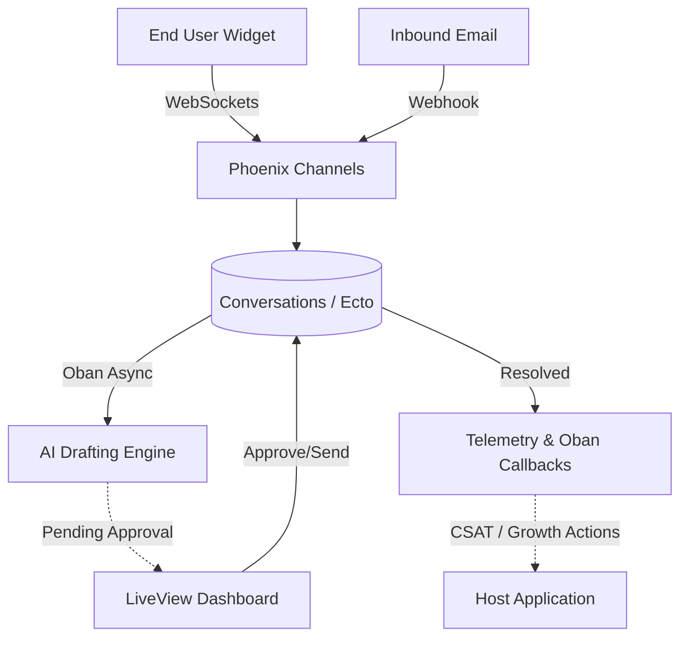

# Cairnloop 🏔️

[](https://hex.pm/packages/cairnloop)
[](https://hexdocs.pm/cairnloop)
[](https://github.com/szTheory/cairnloop/actions)

An embedded, Phoenix-native customer support automation layer for Elixir applications. 

Cairnloop turns support conversations into answers, product signals, knowledge-base improvements, and safe automated actions—directly inside your existing monolith. Deflect what can be deflected, draft what cannot, and escalate risks cleanly.

## ⚡️ Why Cairnloop?

* **SaaS in a Box:** Don't build a brittle syncing layer to external CRMs. Embed the support widget directly into your LiveView app.
* **Strict Decoupling:** Emits Elixir native `:telemetry` events for observability without blocking the request.
* **Safe Automation:** Human-in-the-loop (HITL) by default. The AI drafts; your operators approve.
* **Customer-Led Growth:** Capture sentiment (CSAT/CES) frictionlessly at the exact moment of resolution.

---

## 🏗️ Architecture at a Glance



## 🚀 Installation

If [available in Hex](https://hex.pm/docs/publish), the package can be installed by adding `cairnloop` to your list of dependencies in `mix.exs`:

```elixir
def deps do
  [
    {:cairnloop, "~> 0.1.0"}
  ]
end
```

Documentation can be generated with [ExDoc](https://github.com/elixir-lang/ex_doc) and published on [HexDocs](https://hexdocs.pm). Once published, the docs can be found at <https://hexdocs.pm/cairnloop>.

## 🔌 Host Integration: Wiring It Up

Cairnloop explicitly separates **Observability** (metrics, tracing) from **Business Logic** (side-effects, CRM sync, state changes). When a conversation is resolved, Cairnloop exposes two integration points for host applications.

### 1. Observability (Telemetry)

Use `:telemetry` to capture metrics and traces without blocking the resolution process. This is ideal for exporting metrics to APMs (DataDog, Prometheus) or logging duration.

```elixir
:telemetry.attach(
  "cairnloop-apm-tracker",
  [:cairnloop, :conversation, :resolved],
  fn _event, measurements, metadata, _config ->
    require Logger
    Logger.info("Conversation #{metadata.conversation_id} resolved by #{metadata.actor.id} in #{measurements.duration_seconds}s")
    
    # Example: Statix.histogram("cairnloop.conversation.duration", measurements.duration_seconds)
  end,
  nil
)
```

### 2. Business Logic (Notifier Behaviour)

For critical side-effects like syncing with a CRM or sending an email, use the `Cairnloop.Notifier` behaviour. This ensures data consistency and allows you to enqueue background jobs reliably.

Define your notifier module in your host application:

```elixir
defmodule MyApp.CairnloopNotifier do
  @behaviour Cairnloop.Notifier

  @impl true
  def on_conversation_resolved(conversation, metadata) do
    actor = metadata[:resolved_by]
    
    # Safely trigger a background job
    %{conversation_id: conversation.id, resolved_by_id: actor.id}
    |> MyApp.Workers.SyncCRMSyncJob.new()
    |> Oban.insert()
    
    :ok
  end
  
  # Implement other required callbacks...
  @impl true
  def on_message_received(_conversation, _message), do: :ok
end
```

Then configure it in your `config/config.exs`:

```elixir
config :cairnloop, :notifier, MyApp.CairnloopNotifier
```
