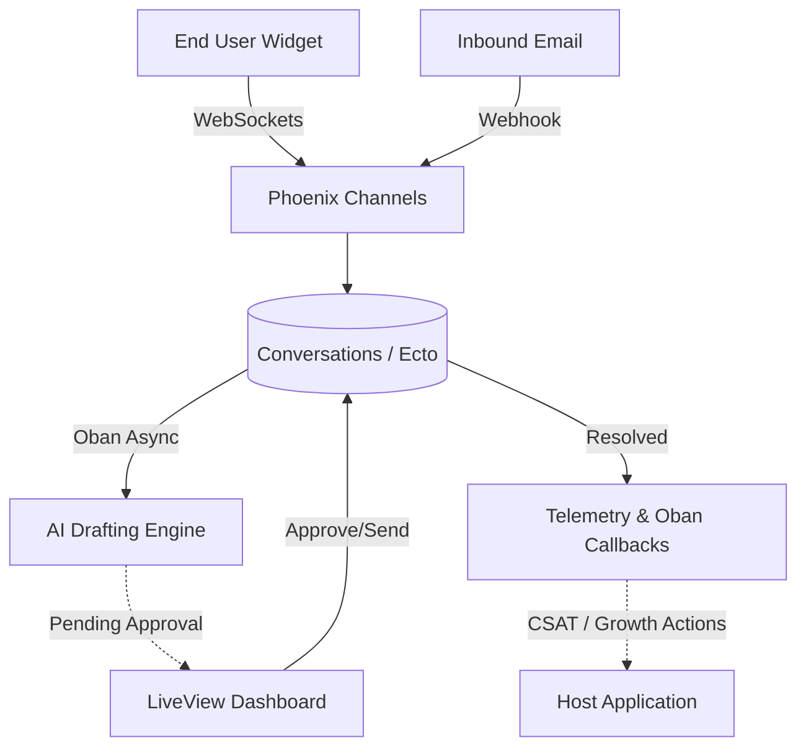

# Cairnloop 🏔️

[](https://hex.pm/packages/cairnloop)
[](https://hexdocs.pm/cairnloop)
[](https://github.com/szTheory/cairnloop/actions)

An embedded, Phoenix-native customer support automation layer for Elixir applications. 

Cairnloop turns support conversations into answers, product signals, knowledge-base improvements, and safe automated actions—directly inside your existing monolith. Deflect what can be deflected, draft what cannot, and escalate risks cleanly.

Want the practical library-user view? Read [Cairnloop, From a Phoenix SaaS Builder's Perspective](docs/cairnloop-jtbd-and-user-flows.md).

## ⚡️ Why Cairnloop?

* **SaaS in a Box:** Don't build a brittle syncing layer to external CRMs. Embed the support widget directly into your LiveView app.
* **Strict Decoupling:** Emits Elixir native `:telemetry` events for observability without blocking the request.
* **Safe Automation:** Human-in-the-loop (HITL) by default. The AI drafts; your operators approve.
* **Customer-Led Growth:** Capture sentiment (CSAT/CES) frictionlessly at the exact moment of resolution.

---

## 🏗️ Architecture at a Glance



## 🚀 Installation

If [available in Hex](https://hex.pm/docs/publish), the package can be installed by adding `cairnloop` to your list of dependencies in `mix.exs`:

```elixir
def deps do
  [
    {:cairnloop, "~> 0.1.0"}
  ]
end
```

Documentation can be generated with [ExDoc](https://github.com/elixir-lang/ex_doc) and published on [HexDocs](https://hexdocs.pm). Once published, the docs can be found at <https://hexdocs.pm/cairnloop>.

## 🔌 Host Integration: Wiring It Up

Cairnloop explicitly separates **Observability** (metrics, tracing) from **Business Logic** (side-effects, CRM sync, state changes). When a conversation is resolved, Cairnloop exposes two integration points for host applications.

### 1. Observability & Domain Events (Telemetry)

Cairnloop uses a **Dual Emission** architecture via `:telemetry` to separate performance tracing from domain business logic. This ensures non-blocking execution while providing rich extensibility.

**A. Tracing Spans (Performance & APMs)**

Use the span lifecycle events (`:start`, `:stop`, `:exception`) to capture execution metrics. This is ideal for exporting to APMs (DataDog, Prometheus) or logging function execution duration.

```elixir
:telemetry.attach(
  "cairnloop-apm-tracker",
  [:cairnloop, :conversation, :resolve, :stop],
  fn _event, measurements, metadata, _config ->
    require Logger
    # Execution time is available in `measurements.duration`
    Logger.info("Resolve function took #{System.convert_time_unit(measurements.duration, :native, :millisecond)}ms")
  end,
  nil
)
```

**B. Domain Events (Business Logic & Extensibility)**

Use past-tense domain events to hook into successful business actions. This is the recommended approach for reacting to support lifecycle changes, such as triggering an in-app "App Store Rating" prompt when an issue is successfully resolved.
```elixir
:telemetry.attach(
  "cairnloop-domain-hooks",
  [:cairnloop, :conversation, :resolved],
  fn _event, measurements, metadata, _config ->
    require Logger

    # metadata.conversation contains the fully updated Ecto struct
    conversation = metadata.conversation
    Logger.info("Conversation #{conversation.id} resolved by #{metadata.actor.id} in #{measurements.duration_seconds}s at #{conversation.resolved_at}")

    # Example: Broadcast to LiveView to show a CSAT modal or App Store prompt
    # Phoenix.PubSub.broadcast(MyApp.PubSub, "user_sessions:#{metadata.host_user_id}", :support_issue_resolved)
  end,
  nil
)
```
### 2. Business Logic (Notifier Behaviour)

For critical side-effects like syncing with a CRM or sending an email, use the `Cairnloop.Notifier` behaviour. These are executed asynchronously via Oban, ensuring data consistency and reliable retries.

The easiest way to get started is to use the included generator:

```bash
mix cairnloop.gen.notifier
```

This will automatically scaffold a Notifier module in your host application and inject the required configuration. 

Alternatively, you can implement it manually:

```elixir
defmodule MyApp.CairnloopNotifier do
  @behaviour Cairnloop.Notifier

  @impl true
  def on_conversation_resolved(conversation, metadata) do
    actor = metadata[:actor]
    
    # Safely trigger a background job
    %{conversation_id: conversation.id, resolved_by_id: actor && actor.id}
    |> MyApp.Workers.SyncCRMSyncJob.new()
    |> Oban.insert()
    
    :ok
  end
  
  @impl true
  def on_sla_breach(conversation, sla, _metadata) do
    # Handle SLA breach notifications
    :ok
  end
end
```

Then configure it in your `config/config.exs`:

```elixir
config :cairnloop, :notifier, MyApp.CairnloopNotifier
```
