# JTBD Walkthrough

This guide walks through the full Jobs-To-Be-Done (JTBD) lifecycle that Cairnloop supports
out of the box. You can follow every stage interactively by running the example app
(`cd examples/cairnloop_example && mix setup && mix phx.server`) and navigating alongside.

> **Route convention:** All support routes are mounted under the path you pass to
> `cairnloop_dashboard/2` in your router. This guide assumes `/support` — the example app's
> default. The customer chat widget lives at `/chat`.

The example app opens on a guided demo index that frames the scenario and links to every stage
below — a good place to start clicking around:

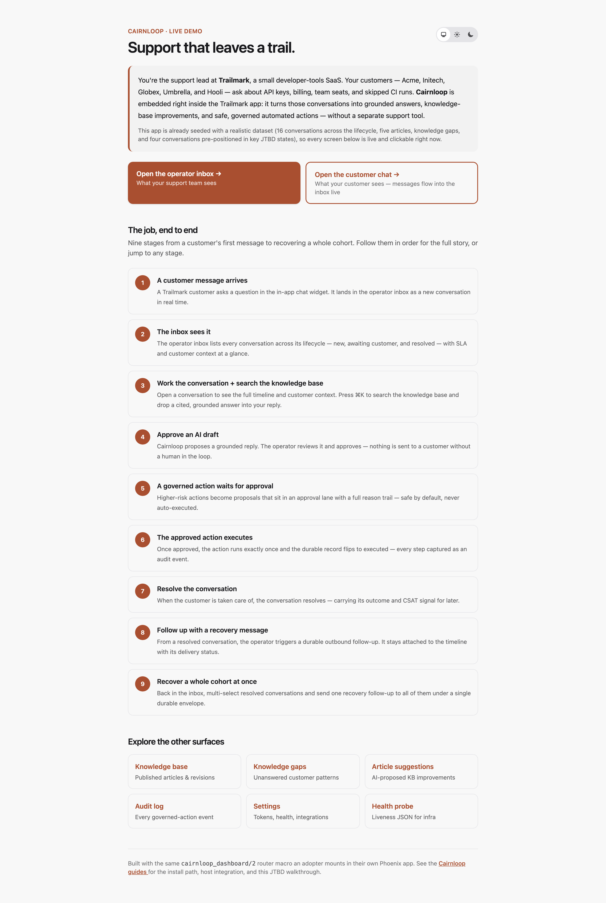

> The screenshots in this guide are captured from the seeded example app. To refresh them, see
> `examples/cairnloop_example/screenshots/`.

---

## Stage 1: Seed — a customer message arrives

A customer submits a message through the embedded chat widget at `/chat`. On the customer side,
the Phoenix Channel (`Cairnloop.Channels.WidgetSocket`) receives the payload, persists a new
`Conversation` row with status `:open`, and appends an initial `Message` record with role `:user`.

No operator action is needed at this point. Cairnloop has recorded the inbound event durably in
Ecto. From here, the conversation is visible across any operator session.

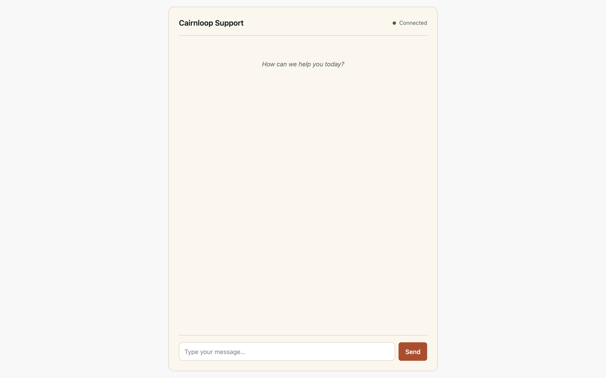

---

## Stage 2: Inbox sees the conversation

The operator navigates to `/support`. The inbox rendered by `Cairnloop.Web.InboxLive` loads all
conversations the current operator can see.

**Screen region:** The inbox lists the seeded conversations spanning all status states — new,
open, awaiting customer, and resolved. Each row shows the conversation subject, the customer
identifier, the time since the last message, and a status chip. The just-seeded conversation
appears at or near the top of the list.

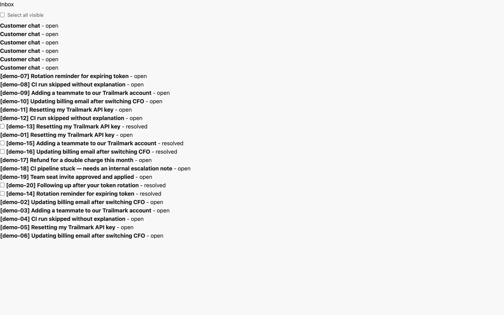

At this stage, the operator can orient themselves across the support queue before selecting a
conversation to work.

---

## Stage 3: Conversation workspace — cmd+k search and citation chip

The operator clicks a conversation row and is taken to `/support/:id` — the conversation
workspace rendered by `Cairnloop.Web.ConversationLive`.

**Screen region:** The workspace splits into a main column (the conversation timeline: customer
messages, operator replies, AI draft cards, action event cards, and outbound bubbles) and a right
rail (customer context from `ContextProvider`, SLA status, governed-action history).

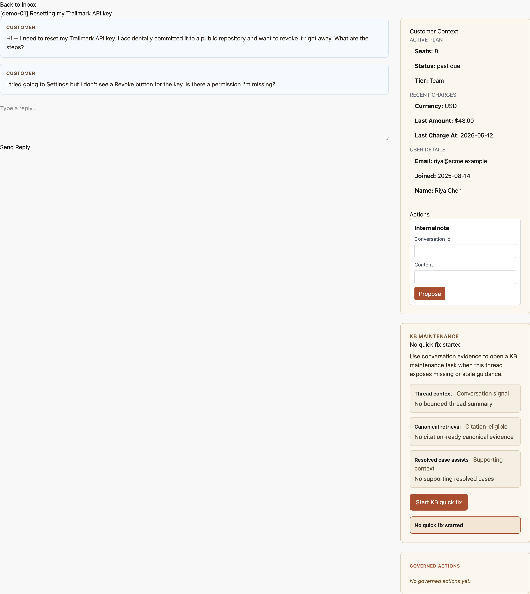

The operator presses `cmd+k` to open the search palette. They type a query — for example,
"refund" — and Cairnloop retrieves matching Knowledge Base articles and resolved support
evidence via the retrieval backend. Results appear with source, recency, and trust cues.

**Screen region:** The cmd+k modal shows a list of retrieval results. Each result card displays
the article title, a short content excerpt, the source type (knowledge base or resolved case),
and a trust level chip. Clicking a result activates it and places a citation chip in the
operator's draft compose area.

The citation chip links the operator's eventual reply back to a grounded retrieval source —
meaning no freeform AI output leaves the thread without an auditable evidence anchor.

---

## Stage 4: Approve AI draft

Cairnloop's AI drafting engine prepares a suggested reply for the conversation. The draft
appears in the conversation timeline as a `Draft` card in `:pending` status, surfaced via
`Cairnloop.Automation`.

**Screen region:** The AI draft card shows the proposed reply text, the draft source
(knowledge base articles or prior resolved cases that grounded the reply), and two actions:
"Approve" and "Dismiss". An approval badge shows that a human decision is required before
anything is sent to the customer.

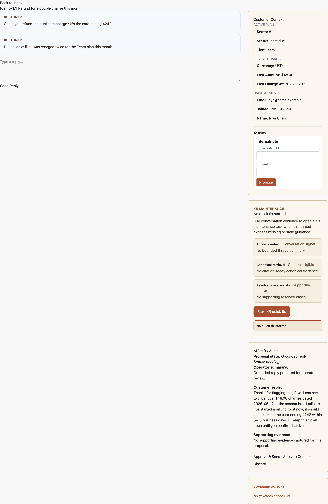

The operator reviews the draft text and evidence, then clicks "Approve". The draft status
transitions to `:approved`. The approved reply is appended to the conversation timeline and
becomes part of the durable support record.

No AI reply is sent to the customer without explicit operator approval. This is the
human-in-the-loop (HITL) guarantee at the reply layer.

---

## Stage 5: Governed tool proposal approve

The operator encounters a situation requiring a structured action — for example, updating an
account field or triggering a downstream system event. Cairnloop's governed-tool contract
routes this through `Cairnloop.Governance.propose/3`, which records a durable `ToolProposal`
row with a snapshotted risk tier, approval mode, and input before any execution occurs.

**Screen region:** The conversation timeline shows a governed-action card in `:pending_approval`
state. The card displays the tool title, a risk tier chip (e.g., "Low Write"), the proposed
inputs, and an approve/reject affordance. Trust facts are snapshotted at proposal time and do
not change between now and execution.

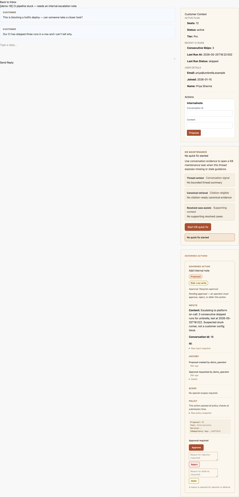

The operator reviews the proposal and clicks "Approve". The approval state machine in
`Cairnloop.Governance` records the decision via `Governance.approve/3`, transitions the
`ToolApproval` record, and enqueues the next step via Oban.

No governed action executes inline. Every proposal waits for explicit operator sign-off before
the execution worker runs.

---

## Stage 6: ToolExecutionWorker reaches :success

With approval granted, `Cairnloop.Workers.ToolExecutionWorker` runs the approved action. The
worker applies three-layer at-most-once idempotency: Oban unique keys, a terminal guard on the
worker itself, and a SHA-256 per-attempt run key.

**Screen region:** The governed-action card in the conversation timeline updates to show
"Action completed" with an execution timestamp. The risk tier chip changes to a success state.
A full append-only `ToolActionEvent` history is recorded on the proposal.

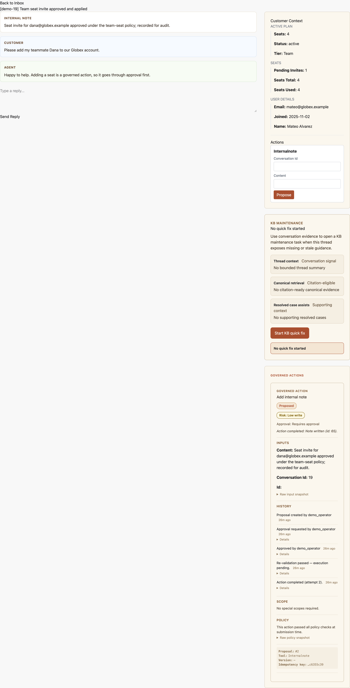

The execution result is part of the durable conversation record. If the worker were to fail or
be retried, the idempotency guarantees prevent the action from running more than once.

---

## Stage 7: Resolve the conversation

The operator closes out the support thread by resolving the conversation. Cairnloop calls
`Cairnloop.Chat.resolve_conversation/2` directly (resolution is a domain function, not a
LiveView event), which transitions the `Conversation` status to `:resolved` and records the
resolution timestamp and actor.

**Screen region:** The conversation status chip in the workspace header changes to "Resolved".
The conversation becomes ineligible for further AI drafting. A resolution timestamp and operator
identifier appear in the thread metadata rail.

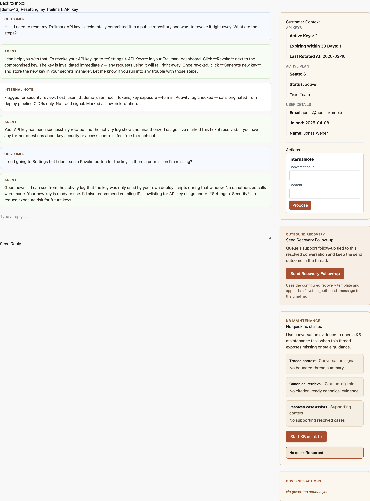

At resolution, Cairnloop emits both a bounded `:telemetry` span and a `[:cairnloop, :conversation, :resolved]`
domain event. The host `Notifier` behaviour receives `on_conversation_resolved/2` — see
[Host Integration](03-host-integration.html) for the full callback set.

---

## Stage 8: Outbound trigger from the sidebar

Now that the conversation is resolved, the operator notices a recovery follow-up opportunity
in the sidebar. The sidebar renders a "Send Recovery Follow-up" button for resolved
conversations that have not yet received a follow-up outbound message.

**Screen region:** The right rail of the resolved conversation shows a "Send Recovery
Follow-up" button. Clicking it opens a confirmation affordance that previews the outbound
message body (rendered from the configured `outbound_recovery_template_id`).

The operator confirms and Cairnloop calls `Cairnloop.Outbound.trigger/2`, which:

1. Appends a `system_outbound` message to the conversation timeline (with `role: :system_outbound`).
2. Enqueues an `OutboundWorker` Oban job that routes through the host's `Notifier.on_outbound_triggered/2`.

**Screen region:** A new outbound bubble appears in the conversation timeline with a "Pending"
delivery chip. After the Oban worker runs, the chip transitions to "Sent" or "Failed"
depending on the Notifier return value.

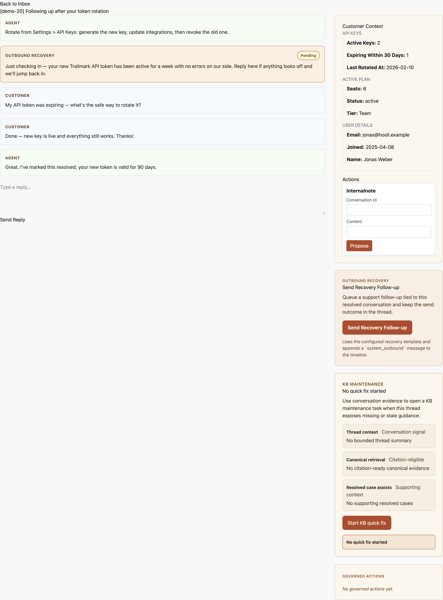

---

## Stage 9: Bulk recovery

The operator navigates back to `/support` and realizes there are several more resolved
conversations that need follow-up. Cairnloop supports bulk outbound via `InboxLive`
multi-select.

**Screen region:** In the inbox, each row has a checkbox. The operator selects multiple
resolved conversations. A bulk action bar appears at the bottom of the inbox listing the
selected count and a "Send recovery follow-up" button.

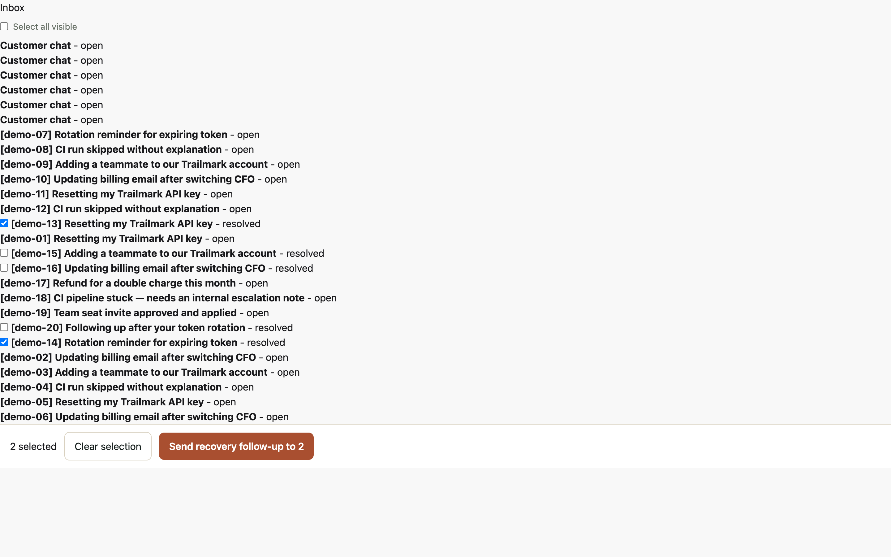

The operator clicks "Send Recovery Follow-up". A confirmation modal appears:

**Screen region:** The modal shows a preview of the outbound message body, a sample of the
first five recipient identifiers, and a count of the total cohort size. If the cohort exceeds
`Cairnloop.Outbound.max_batch_size` (25), a fail-closed refusal banner replaces the confirm
button — the bulk send is refused rather than silently capping the batch.

The operator confirms. Cairnloop calls `Cairnloop.Outbound.bulk_trigger/2`, which:

1. Records a `BulkEnvelope` audit row with status `:submitted` (or `:refused_cap_exceeded` if
   the cap was exceeded).
2. Enqueues one `OutboundWorker` Oban job per recipient, each with an at-most-once Oban unique
   key scoped to `(conversation_id, template_id, bulk_envelope_id)`.

**Screen region:** The bulk action bar disappears and the inbox deselects all rows. Each
recipient conversation now has a pending outbound bubble in its timeline. Operators can inspect
the `BulkEnvelope` row via the Governance audit facade
(`Cairnloop.Governance.list_recent_bulk_outbound_envelopes/1`).

---

This walkthrough covers all nine stages of the JTBD lifecycle from first customer message
through bulk recovery fan-out. The same sequence is exercised in CI by the integration smoke
test at `test/integration/golden_path_test.exs`.

---

## Beyond the thread: the supporting surfaces

The same operator dashboard exposes the surfaces that turn day-to-day support into durable
knowledge and an auditable trail.

**Knowledge base** (`/support/knowledge-base`) — published articles and their revision history:

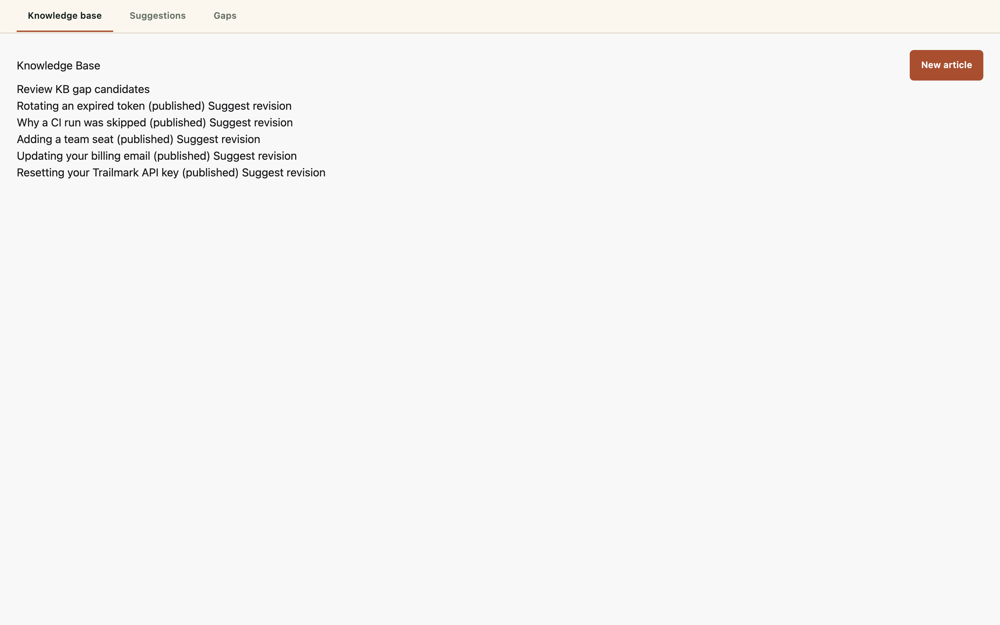

**Knowledge gaps** (`/support/knowledge-base/gaps`) — recurring unanswered patterns surfaced from
real conversations, ready to become new articles:

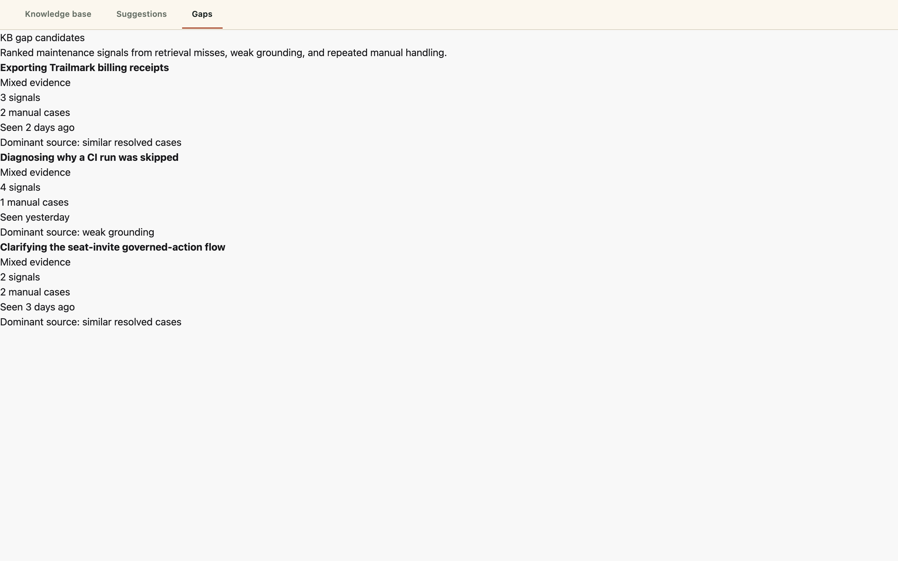

**Audit log** (`/support/audit-log`) — the append-only timeline of every governed-action event,
newest first:

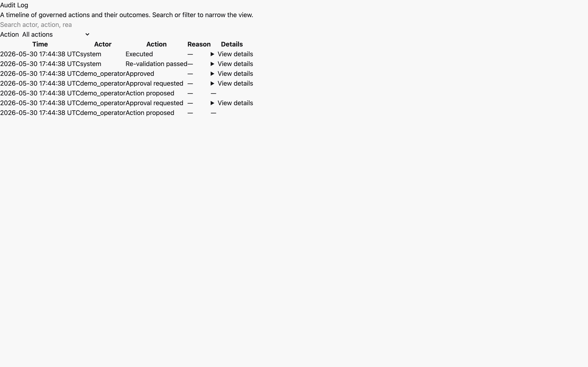

**Settings** (`/support/settings`) — MCP tokens, Notifier health, the retrieval index, and Oban
job state:

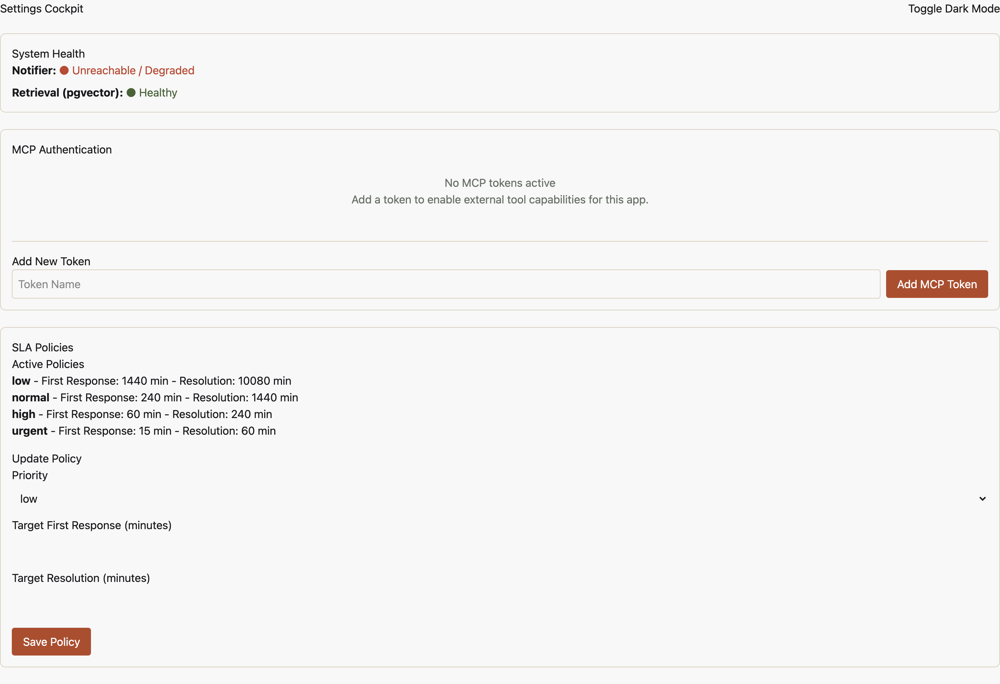

> **Refreshing these screenshots:** boot the seeded example app
> (`cd examples/cairnloop_example && mix ecto.reset && mix phx.server`) and run the capture tool in
> `examples/cairnloop_example/screenshots/` (`npm install && npm run capture`). It drives the demo
> with Playwright and rewrites `guides/assets/`. The capture is non-gating and asserts nothing —
> the deterministic `test/integration/golden_path_test.exs` remains the source of CI truth.
